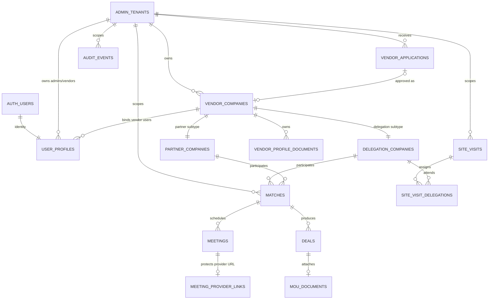

# Database Schema

**Owner:** Engineering and data/security
**Review trigger:** Every database migration
**Last verified against live Supabase:** 2026-07-28; next migration reviewed 2026-07-29
**Project:** `Plexus` (`pnjblggcdigekluualin`)

## Source of truth

Committed migrations in `supabase/migrations/` are the schema source of truth.
This document is a reviewed human-readable snapshot of the live project plus
the next committed migration where explicitly marked.

Current committed inventory after the Vendor application migration (apply and
advisor verification remain release steps):

- PostgreSQL 17
- 31 migrations
- 25 public tables
- 25 of 25 public tables have RLS enabled
- 80 public-table RLS policies
- 0 public views and 0 public enum types
- 4 Storage buckets: private `event-resources`, public `tenant-branding`,
  private `vendor-profile-documents`, and private `mou-documents`
- Supabase security advisor: no error or warning findings on 2026-07-28; the
  two informational no-policy notices are the intentionally server-only
  `oauth_tokens` and `meeting_provider_links` tables

Status values are enforced with `CHECK` constraints rather than PostgreSQL enum
types.

## Core entity model



## Identity, tenancy, and governance

```text
admin_tenants (
  id uuid PK default gen_random_uuid(),
  slug text UNIQUE NOT NULL,
  name text NOT NULL,
  status text NOT NULL default 'active',
  support_email text NOT NULL default '',
  logo_url text NOT NULL default '',
  primary_color text NOT NULL default '#16839a',
  vendor_discovery_enabled boolean NOT NULL default true,
  meeting_availability jsonb NOT NULL default
    '{"1":["10:00","11:00","14:00","15:00"],"2":["10:00","11:00","14:00","15:00"],"3":["10:00","11:00","14:00","15:00"],"4":["10:00","11:00","14:00","15:00"],"5":["10:00","11:00","14:00","15:00"]}',
  created_at timestamptz NOT NULL default now(),
  updated_at timestamptz NOT NULL default now()
)

vendor_companies (
  id uuid PK default gen_random_uuid(),
  admin_id uuid NOT NULL FK -> admin_tenants.id,
  vendor_type text NOT NULL,
  name_en text NOT NULL,
  name_cn text NOT NULL default '',
  sector text NOT NULL default 'Pending',
  status text NOT NULL default 'active',
  created_by uuid NULL FK -> auth.users.id,
  created_at timestamptz NOT NULL default now(),
  updated_at timestamptz NOT NULL default now(),
  UNIQUE (id, admin_id),
  UNIQUE (id, vendor_type)
)

user_profiles (
  id uuid PK FK -> auth.users.id,
  role text NOT NULL,
  display_name text NOT NULL,
  email text NOT NULL default '',
  admin_id uuid NULL FK -> admin_tenants.id,
  vendor_company_id uuid NULL,
  vendor_type text NULL,
  delegation_company_id uuid NULL FK -> delegation_companies.id,
  partner_company_id uuid NULL FK -> partner_companies.id,
  active boolean NOT NULL default true,
  created_at timestamptz NOT NULL default now(),
  updated_at timestamptz NOT NULL default now(),
  FK (vendor_company_id, admin_id) -> vendor_companies(id, admin_id),
  FK (vendor_company_id, vendor_type) -> vendor_companies(id, vendor_type)
)

platform_settings (
  id uuid PK default gen_random_uuid(),
  setting_key text UNIQUE NOT NULL,
  category text NOT NULL,
  value jsonb NOT NULL default null,
  description text NOT NULL default '',
  updated_by uuid NULL FK -> auth.users.id,
  created_at timestamptz NOT NULL default now(),
  updated_at timestamptz NOT NULL default now()
)

audit_events (
  id uuid PK default gen_random_uuid(),
  actor_user_id uuid NULL FK -> auth.users.id,
  actor_role text NULL,
  action text NOT NULL,
  target_table text NOT NULL,
  target_id uuid NULL,
  admin_id uuid NULL FK -> admin_tenants.id,
  request_id text NULL,
  before_values jsonb NULL,
  after_values jsonb NULL,
  created_at timestamptz NOT NULL default now()
)

vendor_applications (
  id uuid PK default gen_random_uuid(),
  admin_id uuid NOT NULL FK -> admin_tenants.id,
  vendor_type text NOT NULL,
  normalized_email text NOT NULL,
  contact_name text NOT NULL,
  company_name text NOT NULL,
  profile_data jsonb NOT NULL,
  profile_complete integer NOT NULL default 100,
  status text NOT NULL default 'pending',
  reviewed_by uuid NULL FK -> auth.users.id,
  reviewed_at timestamptz NULL,
  vendor_company_id uuid NULL FK -> vendor_companies.id,
  auth_user_id uuid NULL FK -> auth.users.id,
  setup_email_sent_at timestamptz NULL,
  created_at timestamptz NOT NULL default now(),
  updated_at timestamptz NOT NULL default now()
)
```

`admin_tenants.vendor_discovery_enabled` is the owning Admin's tenant capability
switch for Vendor self-service browsing. When disabled, the application hides
the Vendor discovery entry point, the protected discovery route redirects to
the Vendor's match list, `match_candidates()` returns no rows, and Vendor
match-request inserts fail. `match_participants()` continues returning only
counterparts already joined to the Vendor through a visible match so existing
match cards retain their company summaries. Admin-managed matching remains
available.

`admin_tenants.meeting_availability` is the owning Admin's recurring Vendor
booking window. JSON keys `1`–`5` represent Monday–Friday and each value is an
array of permitted one-hour start times (`09:00`, `10:00`, `11:00`, `14:00`,
`15:00`, or `16:00`) in Asia/Kuala_Lumpur. A private immutable check function
rejects malformed day/time values. Vendors receive only the dates/times derived
from their own tenant row, and the scheduling action re-reads this value before
accepting a slot.

Binding constraints:

- `superadmin`: no `admin_id`, Vendor company, or Vendor type.
- `admin`: `admin_id` required; Vendor company/type absent.
- `vendor`: `admin_id`, `vendor_company_id`, and `vendor_type` required.
- Role is limited to `superadmin`, `admin`, or `vendor`.
- Vendor type is limited to `delegation` or `partner`.
- Tenant and Vendor status is limited to `active`, `suspended`, or `archived`.
- Vendor application status is limited to `pending`, `provisioning`,
  `approved`, or `rejected`. A partial unique index permits only one
  non-rejected application per normalized email. Approved rows require both
  resulting IDs; rejected rows require reviewer evidence.

`vendor_applications` contains the complete submitted company profile but no
password or file upload. Anonymous roles have no table grants. The stable
public route writes through the server-only client after validating an active
tenant. Active owning Admins can read/review only their tenant; Superadmins
have governance read/update access; Vendors have no access. A trigger protects
the immutable tenant, subtype, email, contact, company, profile, and creation
fields and permits only the reviewed status transitions. Approval and rejection
finalization are service-role-only database functions called after the server
revalidates the active owning Admin; reviewer and resulting Auth foreign keys
have covering indexes.

## Vendor company subtypes and discovery

```text
delegation_companies (
  id uuid PK default gen_random_uuid(),
  vendor_company_id uuid UNIQUE NOT NULL FK -> vendor_companies.id,
  admin_id uuid NOT NULL FK -> admin_tenants.id,
  vendor_type text NOT NULL default 'delegation',
  name_en text NOT NULL,
  name_cn text NOT NULL,
  sector text NOT NULL,
  origin text NOT NULL,
  company_size text NOT NULL,
  needs text NOT NULL,
  contact text NOT NULL,
  contact_meta text NOT NULL,
  status text NOT NULL,
  profile_complete integer NOT NULL default 0,
  urgent boolean NOT NULL default false,
  coordinator text NOT NULL,
  profile_data jsonb NOT NULL default {},
  created_at timestamptz NOT NULL default now(),
  updated_at timestamptz NOT NULL default now(),
  UNIQUE (id, admin_id)
)

partner_companies (
  id uuid PK default gen_random_uuid(),
  vendor_company_id uuid UNIQUE NOT NULL FK -> vendor_companies.id,
  admin_id uuid NOT NULL FK -> admin_tenants.id,
  vendor_type text NOT NULL default 'partner',
  name_en text NOT NULL,
  name_cn text NOT NULL,
  sector text NOT NULL,
  partner_type text NOT NULL,
  company_size text NOT NULL,
  offerings text NOT NULL,
  contact text NOT NULL,
  contact_meta text NOT NULL,
  status text NOT NULL,
  profile_complete integer NOT NULL default 0,
  verified text NOT NULL,
  attendance text NOT NULL,
  arrived boolean NOT NULL default false,
  profile_data jsonb NOT NULL default {},
  created_at timestamptz NOT NULL default now(),
  updated_at timestamptz NOT NULL default now(),
  UNIQUE (id, admin_id)
)

match_candidate_directory (
  company_type text NOT NULL,
  id uuid NOT NULL,
  name_en text NOT NULL,
  name_cn text NOT NULL,
  sector text NOT NULL,
  admin_id uuid NOT NULL FK -> admin_tenants.id,
  PK (company_type, id)
)
```

Subtype records and the candidate directory are synchronized by private
triggers. Vendor authorization uses the canonical `vendor_companies` identity;
subtype tables hold subtype-specific operating data.

Important checks:

- Profile completeness is between 0 and 100.
- Delegation status: `Onboarded`, `Invited`, `Incomplete`, or `Locked`.
- Partner type: `Government`, `Association`, or `Enterprise`.
- Partner status: `Sourced`, `Invited`, `Confirmed`, or `Declined`.
- Partner verification: `Verified`, `Pending`, or `Flagged`.
- Partner attendance: `Invited`, `Confirmed`, `Declined`, or `Arrived`.

## Matching, meetings, and deals

```text
matches (
  id uuid PK default gen_random_uuid(),
  delegation_company_id uuid NOT NULL FK -> delegation_companies.id,
  partner_company_id uuid NOT NULL FK -> partner_companies.id,
  admin_id uuid NOT NULL FK -> admin_tenants.id,
  status text NOT NULL,
  score integer NOT NULL,
  note text NOT NULL,
  delegation_accepted_at timestamptz NULL,
  partner_accepted_at timestamptz NULL,
  created_at timestamptz NOT NULL default now(),
  updated_at timestamptz NOT NULL default now(),
  UNIQUE (delegation_company_id, partner_company_id),
  UNIQUE (id, admin_id)
)

meeting_proposals (
  id uuid PK default gen_random_uuid(),
  admin_id uuid NOT NULL FK -> admin_tenants.id,
  match_id uuid NOT NULL,
  starts_at timestamptz NOT NULL,
  duration_minutes integer NOT NULL default 60,
  requested_interpreter_id uuid NULL FK -> interpreters.id,
  requested_by_vendor_type text NULL,
  requested_by_vendor_company_id uuid NULL FK -> vendor_companies.id,
  delegation_approved_at timestamptz NULL,
  delegation_approved_by uuid NULL FK -> auth.users.id,
  partner_approved_at timestamptz NULL,
  partner_approved_by uuid NULL FK -> auth.users.id,
  status text NOT NULL default 'pending',
  meeting_id uuid UNIQUE NULL FK -> meetings.id,
  created_at timestamptz NOT NULL default now(),
  updated_at timestamptz NOT NULL default now(),
  FK (match_id, admin_id) -> matches(id, admin_id)
)

meetings (
  id uuid PK default gen_random_uuid(),
  match_id uuid NOT NULL FK -> matches.id,
  admin_id uuid NOT NULL FK -> admin_tenants.id,
  starts_at timestamptz NOT NULL,
  duration_minutes integer NOT NULL,
  platform text NOT NULL,
  link text NOT NULL,
  interpreter text NOT NULL,
  requested_interpreter_id uuid NULL FK -> interpreters.id,
  host text NOT NULL,
  status text NOT NULL,
  summary text NOT NULL,
  created_at timestamptz NOT NULL default now(),
  updated_at timestamptz NOT NULL default now()
)

meeting_provider_links (
  id uuid PK default gen_random_uuid(),
  meeting_id uuid UNIQUE NOT NULL FK -> meetings.id,
  slug text UNIQUE NOT NULL,
  provider text NOT NULL,
  topic text NULL,
  join_url text NOT NULL,
  provider_meeting_id text NULL,
  available_at timestamptz NOT NULL,
  expires_at timestamptz NOT NULL,
  open_count integer NOT NULL default 0,
  max_opens integer NOT NULL default 10,
  created_at timestamptz NOT NULL default now(),
  updated_at timestamptz NOT NULL default now()
)

oauth_tokens (
  id text PK,
  refresh_token text NOT NULL,
  access_token text NULL,
  expires_at timestamptz NULL,
  refresh_token_expires_at timestamptz NULL,
  updated_at timestamptz NOT NULL default now()
)

meeting_creation_jobs (
  id uuid PK default gen_random_uuid(),
  match_id uuid UNIQUE NOT NULL,
  admin_id uuid NOT NULL,
  provider text NOT NULL,
  status text NOT NULL,
  attempt_count integer NOT NULL default 1,
  failure_code text NULL,
  failure_summary text NULL,
  last_attempt_at timestamptz NOT NULL default now(),
  resolved_at timestamptz NULL,
  created_at timestamptz NOT NULL default now(),
  updated_at timestamptz NOT NULL default now(),
  FK (match_id, admin_id) -> matches(id, admin_id)
)

deals (
  id uuid PK default gen_random_uuid(),
  match_id uuid NOT NULL FK -> matches.id,
  admin_id uuid NOT NULL FK -> admin_tenants.id,
  status text NOT NULL,
  document text NOT NULL,
  signatory_check text NOT NULL,
  delegation_signed_at timestamptz NULL,
  delegation_signed_by uuid NULL FK -> user_profiles.id,
  partner_signed_at timestamptz NULL,
  partner_signed_by uuid NULL FK -> user_profiles.id,
  created_at timestamptz NOT NULL default now(),
  updated_at timestamptz NOT NULL default now(),
  UNIQUE (id, admin_id),
  UNIQUE (match_id)
)

mou_documents (
  id uuid PK default gen_random_uuid(),
  deal_id uuid UNIQUE NOT NULL,
  admin_id uuid NOT NULL FK -> admin_tenants.id,
  uploaded_by uuid NOT NULL FK -> user_profiles.id,
  file_name text NOT NULL,
  storage_path text UNIQUE NOT NULL,
  mime_type text NOT NULL default 'application/pdf',
  file_size bigint NOT NULL,
  created_at timestamptz NOT NULL default now(),
  updated_at timestamptz NOT NULL default now(),
  FK (deal_id, admin_id) -> deals(id, admin_id)
)
```

Tenant-consistency foreign keys prevent a match, meeting, or deal from
referencing a record owned by another Admin tenant.

Important checks:

- Match score is between 0 and 100.
- Match status: `Proposed`, `Accepted`, `Rejected`, or `Session Scheduled`.
- `Accepted` and `Session Scheduled` require both acceptance timestamps.
- A Vendor can set or clear only its own acceptance timestamp. A one-sided
  acceptance may be cleared while the other timestamp is empty and no meeting
  exists. Once the other Vendor accepts or a meeting is arranged, withdrawal
  is denied. Vendors cannot set `Rejected`; the trigger derives `Accepted`
  only after both participating Vendors agree.
- When a Vendor accepts a legacy `Rejected` row, the action returns the row to
  `Proposed` while recording that Vendor's acceptance. Admins retain the
  authority to reset a match to `Proposed` or `Rejected`.
- Meeting platform: `Pending`, `Zoom`, `Lark`, or legacy `VooV`.
- Meeting status: `Scheduled`, `Live`, `Completed`, or `Cancelled`.
- Vendor-selected times are stored first in `meeting_proposals`. The proposer
  approves only its own subtype, the counterpart must approve independently,
  and the database trigger creates the canonical `meetings` row only when both
  approval timestamps and authenticated actor IDs exist. One partial approval
  never creates a meeting.
- Only one pending proposal may exist per tenant match. Proposal creation and
  second approval both require a future slot that is open in the accepted
  match's `admin_tenants.meeting_availability`; a stale, closed, off-hour,
  weekend, duplicate, or cross-tenant slot is rejected.
- Future legacy `Pending` placeholder meetings are migrated back to neutral
  pending proposals and require fresh approval from both Vendors because the
  original implementation did not record the proposing actor.
- `complete_meeting_with_mou()` completes an Admin-owned meeting and creates
  the match's one pending deal in the same transaction. Repeated completion is
  idempotent because `deals.match_id` is unique.
- `sign_vendor_mou()` accepts only an active Vendor participating on the exact
  match after a completed meeting. It records only that Vendor subtype's
  authenticated user and timestamp. One signature produces `Agreement
Reached`; both produce `Signed` and `Verified`. Admins and unrelated Vendors
  cannot call the function successfully.
- `protect_mou_signature_evidence` makes the recorded signer UUIDs and
  timestamps append-only. Even an owning Admin cannot clear, replace, or
  fabricate a Vendor signature through a direct deal update.
- A `Signed` deal requires both Vendor signature timestamps. Legacy signed
  rows retain their prior meaning through migration-time timestamps.
- Provider links require HTTPS, at least 32 slug characters, a positive access
  limit, and an expiry after their activation time.
- `oauth_tokens` and `meeting_provider_links` have RLS enabled, no
  anon/authenticated policies, and revoked browser-role grants. Only the
  server-only Supabase administration client can access them.
- `meeting_creation_jobs` is service-written and unique per match. Authenticated
  access is select-only and RLS permits only an active Superadmin, exposing
  sanitized status/failure fields rather than provider payloads.
- Deal status: `Under Discussion`, `Agreement Reached`, `Signed`, or `Failed`.
- Signatory check: `Verified`, `Pending`, or `Flagged`.

## Event operations

```text
interpreters (
  id uuid PK default gen_random_uuid(),
  admin_id uuid NOT NULL FK -> admin_tenants.id,
  name text NOT NULL,
  languages text NOT NULL,
  email text NOT NULL default '',
  notes text NOT NULL default '',
  available boolean NOT NULL default true,
  created_at timestamptz NOT NULL default now(),
  updated_at timestamptz NOT NULL default now()
)

itinerary_slots (
  id uuid PK default gen_random_uuid(),
  admin_id uuid NOT NULL FK -> admin_tenants.id,
  day_label text NOT NULL,
  start_time text NOT NULL,
  activity text NOT NULL,
  venue text NOT NULL,
  escort text NOT NULL,
  published boolean NOT NULL default false,
  sort_order integer NOT NULL default 0,
  created_at timestamptz NOT NULL default now(),
  updated_at timestamptz NOT NULL default now()
)

site_visits (
  id uuid PK default gen_random_uuid(),
  admin_id uuid NOT NULL FK -> admin_tenants.id,
  venue text NOT NULL,
  visit_date date NOT NULL,
  start_time text NOT NULL,
  driver text NOT NULL,
  escort text NOT NULL,
  status text NOT NULL,
  notes text NOT NULL,
  created_at timestamptz NOT NULL default now(),
  updated_at timestamptz NOT NULL default now()
)

site_visit_delegations (
  site_visit_id uuid NOT NULL FK -> site_visits.id,
  delegation_company_id uuid NOT NULL FK -> delegation_companies.id,
  admin_id uuid NOT NULL FK -> admin_tenants.id,
  PK (site_visit_id, delegation_company_id)
)

liaison_contacts (
  id uuid PK default gen_random_uuid(),
  admin_id uuid NOT NULL FK -> admin_tenants.id,
  name text NOT NULL,
  title text NOT NULL,
  organisation text NOT NULL,
  status text NOT NULL,
  protocol text NOT NULL,
  created_at timestamptz NOT NULL default now(),
  updated_at timestamptz NOT NULL default now()
)
```

Site-visit status is `Planned`, `Confirmed`, or `Completed`. Liaison status is
`Draft`, `Confirmed`, or `Briefed`.

## Communications and resources

```text
announcements (
  id uuid PK default gen_random_uuid(),
  admin_id uuid NOT NULL FK -> admin_tenants.id,
  title text NOT NULL,
  message text NOT NULL,
  target text NOT NULL,
  channel text NOT NULL,
  status text NOT NULL,
  sent_at timestamptz NULL,
  created_by text NOT NULL,
  created_at timestamptz NOT NULL default now(),
  updated_at timestamptz NOT NULL default now()
)

notifications (
  id uuid PK default gen_random_uuid(),
  admin_id uuid NOT NULL FK -> admin_tenants.id,
  message text NOT NULL,
  created_at timestamptz NOT NULL default now()
)

event_resources (
  id uuid PK default gen_random_uuid(),
  admin_id uuid NOT NULL FK -> admin_tenants.id,
  title text NOT NULL,
  category text NOT NULL,
  file_name text NOT NULL,
  file_url text NOT NULL,
  storage_path text NULL,
  audience text NOT NULL,
  visible_to_delegation boolean NOT NULL default false,
  notes text NOT NULL default '',
  created_at timestamptz NOT NULL default now(),
  updated_at timestamptz NOT NULL default now()
)

email_deliveries (
  id uuid PK default gen_random_uuid(),
  admin_id uuid NULL FK -> admin_tenants.id,
  sender_type text NOT NULL,
  sender_user_id uuid NULL FK -> auth.users.id,
  sender_name text NOT NULL,
  from_address text NOT NULL,
  recipient_email text NOT NULL,
  recipient_name text NOT NULL,
  recipient_role text NOT NULL,
  trigger_key text NOT NULL,
  subject text NOT NULL,
  provider text NOT NULL,
  provider_message_id text NULL UNIQUE,
  status text NOT NULL,
  status_detail text NOT NULL,
  source_table text NULL,
  source_id text NULL,
  idempotency_key text NOT NULL UNIQUE,
  requested_at timestamptz NOT NULL,
  sent_at timestamptz NULL,
  delivered_at timestamptz NULL,
  opened_at timestamptz NULL,
  clicked_at timestamptz NULL,
  failed_at timestamptz NULL,
  last_event_at timestamptz NULL,
  created_at timestamptz NOT NULL default now(),
  updated_at timestamptz NOT NULL default now()
)

email_delivery_events (
  id uuid PK default gen_random_uuid(),
  delivery_id uuid NOT NULL FK -> email_deliveries.id,
  provider_event_id text NOT NULL UNIQUE,
  event_type text NOT NULL,
  occurred_at timestamptz NOT NULL,
  event_data jsonb NOT NULL default '{}',
  created_at timestamptz NOT NULL default now()
)

vendor_profile_documents (
  id uuid PK default gen_random_uuid(),
  admin_id uuid NOT NULL FK -> admin_tenants.id,
  vendor_company_id uuid NOT NULL,
  vendor_type text NOT NULL,
  uploaded_by uuid NOT NULL FK -> user_profiles.id,
  file_name text NOT NULL,
  storage_path text NOT NULL UNIQUE,
  mime_type text NOT NULL default 'application/pdf',
  file_size bigint NOT NULL,
  created_at timestamptz NOT NULL default now(),
  FK (vendor_company_id, admin_id) -> vendor_companies(id, admin_id),
  FK (vendor_company_id, vendor_type) -> vendor_companies(id, vendor_type)
)
```

Announcement and resource audience is `all`, `delegation`, `partner`, or
`admin`. The `event-resources` Storage bucket is private, has a 15 MiB file
limit, and accepts PDF, JPEG, PNG, WebP, DOCX, and PPTX files.

`email_deliveries` is a recipient-level operational ledger. It stores no
message body, reset link, credential, or raw provider response. Resend API
messages advance from queued/sent through verified webhook lifecycle states.
Supabase Auth recovery and setup messages remain `requested` because the Auth
SMTP call does not expose a provider message ID that Plexus can safely
correlate. `email_delivery_events` stores only an idempotent provider event ID,
event type, occurrence time, and sanitized metadata. Recipient lifecycle,
trigger, tenant, sender grouping, provider-message correlation, and both
delivery foreign keys have covering indexes.

The `tenant-branding` Storage bucket is public because tenant logos must render
on unauthenticated login pages. It has a 2 MiB file limit and accepts only PNG,
JPEG, and WebP. Logo objects are stored below the owning Admin tenant UUID.
Uploads are authorized by the application, checked by file signature, and
written through the server-only Supabase administration client.

The `vendor-profile-documents` Storage bucket is private, accepts only PDF, and
has a 6 MiB file limit. Objects use
`<admin_id>/<vendor_company_id>/<document_id>-<sanitized-file-name>` paths.
The route handler verifies the `.pdf` extension, declared MIME type, file size,
and `%PDF-` signature before upload. Metadata and object policies both require
the active Vendor's exact tenant/company binding. Authorized Admins and
Superadmins may read or delete within their existing governance scope, but the
Vendor UI exposes only its own company library. Review uses a 60-second signed
URL; delete removes the object and metadata record.

The `mou-documents` Storage bucket is private, accepts only PDF, and has a
10 MiB limit. Each deal has at most one authoritative metadata row, while a
replacement writes a new object before removing the superseded object. Paths
use `<admin_id>/<deal_id>/<upload_id>-<sanitized-file-name>`. Only the owning
Admin tenant may insert, replace, or delete; only that Admin and Vendors
participating in the deal's match may read. Review uses a 60-second signed URL,
and deal/document changes are written to `audit_events`. A database trigger
keeps the legacy deal document label synchronized in the same transaction as
metadata insert, replacement, or deletion.

## RLS access summary

| Data class              | Superadmin  | Admin                     | Vendor                         |
| ----------------------- | ----------- | ------------------------- | ------------------------------ |
| Tenants                 | All         | Own tenant                | Own tenant reference           |
| User profiles           | All         | Own tenant Vendors        | Own active profile             |
| Vendor directory        | All         | Own tenant                | Own company                    |
| Subtype profile         | All         | Own tenant                | Own subtype/company            |
| Candidate directory     | All         | Own tenant                | Opposite subtype in own tenant |
| Matches/meetings/deals  | All         | Own tenant                | Records involving own company  |
| Provider links/tokens   | Server only | Server only               | Server only                    |
| Itinerary               | All         | Own tenant manage         | Published own-tenant entries   |
| Site visits             | All         | Own tenant manage         | Assigned Delegation only       |
| Announcements/resources | All         | Own tenant manage         | Permitted audience             |
| Email delivery ledger   | Read-only   | None                      | None                           |
| Profile documents       | All         | Own tenant read/delete    | Own company upload/read/delete |
| Settings                | All/manage  | Provisioning setting read | None                           |
| Audit events            | All         | Own tenant read           | None                           |

All policies first require an active actor. Write policies use both `USING` and
`WITH CHECK` where applicable so a user cannot move a row outside its permitted
scope.

## Realtime publication

The `supabase_realtime` publication includes `delegation_companies`,
`partner_companies`, `matches`, `meeting_proposals`, `meetings`, and `deals`.
The Vendor workspace
subscribes only to its own subtype/company row, its participating match rows,
and the meeting/deal rows related to its currently visible match IDs.
Postgres Changes authorization continues to use the tables' existing RLS
policies; the browser receives no service-role credential.

The client listens to insert and update events, then reloads the complete
authorized server read model so all four dashboard cards remain consistent.
Focus, visibility, and a 60-second recovery refresh cover missed connections
and deletion events without exposing unfilterable delete payloads.

## Public functions

| Function                          | Purpose                                                                                          |
| --------------------------------- | ------------------------------------------------------------------------------------------------ |
| `current_app_role()`              | Read trusted role claim                                                                          |
| `current_admin_id()`              | Read trusted tenant binding                                                                      |
| `current_vendor_company_id()`     | Read trusted Vendor binding                                                                      |
| `current_vendor_type()`           | Read trusted Vendor subtype                                                                      |
| `current_delegation_company_id()` | Legacy subtype compatibility                                                                     |
| `current_partner_company_id()`    | Legacy subtype compatibility                                                                     |
| `match_candidates()`              | Return eligible name/sector summaries only while owning-tenant Vendor discovery is enabled       |
| `match_participants()`            | Return limited summaries for counterparties already joined to the Vendor through visible matches |
| `transfer_vendor(uuid, uuid)`     | Audited Superadmin Vendor transfer                                                               |
| `touch_updated_at()`              | Timestamp maintenance trigger                                                                    |

The public authorization helpers are invoker functions. Sensitive auditing,
binding protection, and synchronization logic lives in the unexposed
`private` schema.

## Schema change procedure

1. Run `npx supabase migration new short_description`.
2. Edit the generated migration; do not rewrite an applied migration.
3. Update this document and any affected security/module docs.
4. Test locally with `npm run test:rls`.
5. Review `npm run supabase:plan`.
6. Run database advisors.
7. Merge the migration and docs together.
8. Apply with `npm run supabase:push`.
9. Verify the live schema and update the verified date above.
