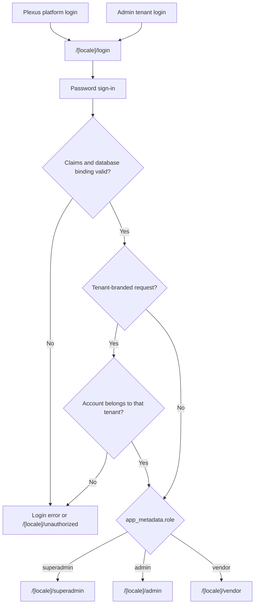

# Routes and Access

**Owner:** Engineering and security
**Review trigger:** Route, role, login, or provisioning change
**Last reviewed:** 2026-08-25

## Login routing

All roles use one email/password login with two presentation modes:

- The Plexus platform login at `/[locale]/login`.
- An active Admin tenant's white-label login through
  `/[locale]/login?tenant=<tenant-slug>` or `<tenant-slug>.plexus.com`.

The tenant mode displays the Admin tenant's name, logo, primary color, and
support contact. Tenant branding is resolved on the server and falls back to
the Plexus platform presentation when the requested tenant is invalid,
inactive, or unavailable.

Authenticated Superadmins and Admins can open
`/[locale]/login-preview?tenantId=<tenant-uuid>` to inspect the tenant
presentation without leaving their operator session. The preview disables
sign-in, Superadmins can inspect any tenant, and Admins can inspect only their
own tenant.



Public Supabase Auth signup remains disabled. An active Admin tenant may share
two application-only links. Applicants submit the canonical company profile;
they do not choose a tenant or subtype and receive no Auth identity until the
owning Admin approves.

The Admin and Vendor sidebars open an in-place account-settings dialog rather
than exposing an additional route. The dialog shows human-readable profile and
workspace information, permits the signed-in user to update only their own
display name, and keeps trusted IDs and authorization bindings out of the UI.
Admins additionally receive tenant-scoped white-label controls; role, tenant,
email ownership, account state, and account deletion remain governed by the
operator workflows and trusted server actions.

Tenant-branded login accepts the owning Admin and Vendors bound to that Admin
tenant. It rejects Superadmins and accounts belonging to any other tenant. The
tenant slug is presentation and validation context only; it never grants a
role, tenant, or company scope.

## Password recovery

All roles can use the tenant-aware **Forgot password?** link:

1. `/{locale}/forgot-password` accepts an email address and always returns the
   same generic success response for valid email syntax.
2. Supabase Auth sends the recovery email without the application querying or
   revealing whether the account exists.
3. `/auth/callback` exchanges the one-time PKCE code for a cookie-backed
   recovery session. The callback accepts only localized
   `/{locale}/reset-password` destinations, preventing an open redirect.
4. `/{locale}/reset-password` requires a verified Supabase user session and
   updates only that signed-in Auth user's password.
5. The recovery session is signed out after the update, and the user returns
   to the matching tenant login to authenticate with the new password.

Approved Vendor onboarding uses the same verified callback with
`mode=setup`. This mode changes the onboarding copy but does not relax callback
validation or password rules.

Production email delivery requires the approved application origin in
Supabase Auth Site URL/redirect settings and a production SMTP provider for
external Admin and Vendor recipients.

## Public marketing routes

| Route                                      | Session requirement | Purpose                                                                   |
| ------------------------------------------ | ------------------- | ------------------------------------------------------------------------- |
| `/` and marketing pages                    | None                | Present the pre-launch platform, governed journey, audiences, and support |
| `/for-program-operators?lang=<locale>`      | None                | Canonical public page for chambers, trade bodies, and event organizers    |
| `/for-vendors?lang=<locale>`                | None                | Compatibility redirect to the program-operator route                      |
| `/pre-event?lang=<locale>`                  | None                | Special worldwide inquiry, matching preparation, and concierge handoff    |
| `/app`                                     | None                | English-only, clearly labelled illustrative pre-launch product preview    |

The public header and homepage route visitors between these three layers and
the localized login without implying that concept capabilities are live. The
main public site and product preview use the Plexus blue editorial system. The
pre-event route remains an intentional emerald/lime campaign exception and
links back to the shared public experience.

The public site and pre-event campaign accept English, Bahasa Malaysia, and Traditional
Chinese through the existing public `lang` query. It lists worldwide departure
countries for inquiry context while identifying Malaysia and Macao separately
as the current live-market focus. Selecting a country prepares a WhatsApp draft
to the configured Plexus number; the page does not submit or persist personal
data, sell travel inventory, issue visas, take payments, or imply operational
coverage in every listed market. Email, callback, regional-messenger, and
co-brand controls remain absent until verified contact or approved brand
configuration exists. Public inquiry channels are read only from
`PLEXUS_PUBLIC_CONTACT_EMAIL`, `PLEXUS_PUBLIC_WHATSAPP_NUMBER`, and
`PLEXUS_PUBLIC_WHATSAPP_DISPLAY`; an unconfigured channel is not rendered.

## Canonical public auth routes

| Route                                             | Session requirement | Purpose                                  |
| ------------------------------------------------- | ------------------- | ---------------------------------------- |
| `/[locale]/login`                                 | None                | Shared role-directed login               |
| `/[locale]/forgot-password`                       | None                | Generic recovery-email request           |
| `/auth/callback`                                  | One-time Auth code  | PKCE recovery-session exchange           |
| `/[locale]/reset-password`                        | Recovered user      | Update the recovered account password    |
| `/[locale]/vendor-signup/[tenantSlug]/delegation` | None                | Tenant-branded Delegation application    |
| `/[locale]/vendor-signup/[tenantSlug]/partner`    | None                | Tenant-branded Partner application       |
| `POST /api/vendor-applications`                   | None                | Validated server-only application insert |

## Canonical protected routes

| Route                       | Allowed role      | Scope                                                                              |
| --------------------------- | ----------------- | ---------------------------------------------------------------------------------- |
| `/[locale]/superadmin`      | Superadmin        | All tenants                                                                        |
| `/[locale]/admin`           | Admin             | Own tenant                                                                         |
| `/[locale]/admin/vendors`   | Admin             | Own tenant Vendors and users                                                       |
| `/[locale]/login-preview`   | Superadmin, Admin | Any tenant or own tenant                                                           |
| `/[locale]/vendor`          | Vendor            | Own company                                                                        |
| `/[locale]/vendor/discover` | Vendor            | Eligible opposite-subtype directory when the owning Admin enables Vendor discovery |
| `/[locale]/compliance`      | Superadmin, Admin | Hidden shell; Admin retains own-tenant sidebar                                     |

Root aliases such as `/login`, `/admin`, `/vendor`, and `/superadmin` redirect
to English. Legacy `/delegation` and `/partner` routes are compatibility
aliases for the Vendor workspace.

An authenticated Vendor whose tenant has disabled Vendor discovery is
redirected from `/[locale]/vendor/discover` to its localized **My matches**
section. The candidate RPC and Vendor match-insert policy enforce the same
tenant capability.

Public login and missing-route interfaces do not enumerate protected portal
paths. The route table above is internal engineering documentation.

The Superadmin route includes **Email sending**, a cross-tenant, read-only
delivery view. It exposes recipient addresses, sanitized provider status, the
initiating actor, and trigger only to an active Superadmin. Admin and Vendor
sessions receive no rows from the underlying ledger.

## Email routes

| Route                            | Access                                | Purpose                                       |
| -------------------------------- | ------------------------------------- | --------------------------------------------- |
| `POST /api/webhooks/resend`      | Valid Resend/Svix signature           | Store idempotent delivery lifecycle events    |
| `GET /api/cron/email-reminders`  | `Authorization: Bearer <CRON_SECRET>` | Send application, meeting, and MOU reminders  |
| `POST /api/admin/communications` | Owning Admin                          | Send tenant email blasts and/or notifications |

The Resend webhook verifies the raw request body before parsing it. It updates
only the row whose provider message ID matches and stores no message content.
The hourly production cron sends pending-application reminders after 24 hours,
meeting reminders approximately 24 hours before start, and daily incomplete
MOU reminders. Existing reminder rows suppress duplicates for the same source
on the same UTC day.

## Meeting routes

| Route                | Access                                       | Purpose                                      |
| -------------------- | -------------------------------------------- | -------------------------------------------- |
| `POST /api/meetings` | Superadmin or owning Admin; both acceptances | Create a Zoom/Lark meeting and wrapped link  |
| `/api/lark/login`    | Superadmin                                   | Start one-time Lark host authorization       |
| `/api/lark/callback` | Superadmin, matching state, PKCE verifier    | Store/rotate the server-only Lark host token |
| `/m/[slug]`          | Opaque time-limited link                     | Count access and redirect to the provider    |

`POST /api/meetings` requires `matchId`, which binds provider creation to an
existing tenant-scoped match. The route refuses creation until both the
Delegation and Partner acceptance timestamps exist. The public `/m/[slug]`
route reveals no database or provider identifier, is inactive before its
meeting time, expires after the meeting, and enforces the configured open
limit.

The Admin meeting dashboard also calls the tenant-scoped
`createManualMeetingAction`. It selects one delegation Vendor and one partner,
creates or reuses their proposed match, and inserts a calendar meeting with the
Admin's validated Zoom or Lark preference. This action never records acceptance
for either Vendor and never creates or exposes a provider URL. For
Vendor-driven matching, the second acceptance unlocks **Propose meeting**;
either Vendor first selects one date and then one time derived from the owning
tenant's published Meeting settings. `proposeMeetingAction` revalidates the
accepted match, tenant ownership, current Admin-open slot, interpreter, and
absence of another future meeting before storing a pending proposal with only
the proposing Vendor's approval. `approveMeetingProposalAction` accepts only
the other participating Vendor's own approval. The database atomically creates
the shared meeting only after both approval actors and timestamps exist. The
owning Admin then confirms the provider session and protected link.

Calendar entries and list rows open the same meeting-details dialog. Its
`updateMeetingAction` revalidates the current Admin tenant, meeting state,
future schedule, duplicate slot, and available interpreter. The Vendor pair is
match-bound and cannot be changed. Once a protected provider link exists, its
platform, date, and duration are locked in this workflow because provider-side
rescheduling is a separate privileged operation; the Admin may still amend the
agenda and interpreter without receiving the provider URL.

## Trusted claim contract

```json
{ "role": "superadmin" }
```

```json
{ "role": "admin", "admin_id": "<tenant-uuid>" }
```

```json
{
  "role": "vendor",
  "admin_id": "<tenant-uuid>",
  "vendor_company_id": "<vendor-uuid>",
  "vendor_type": "delegation"
}
```

A Vendor type may be `delegation` or `partner`. Claims are rejected when they
do not exactly match an active `user_profiles` row, active Admin tenant, and
active Vendor company.

## Account provisioning

### Superadmin creates Admin

1. Create `admin_tenants`.
2. Create a confirmed Supabase Auth user through the server-only Admin API.
3. Set trusted Admin claims in `app_metadata`.
4. Create the matching active `user_profiles` record.
5. Roll back the tenant/Auth user if a later step fails.
6. Audit the privileged change.

### Admin creates Vendor

1. Verify the Admin is active and provisioning is enabled.
2. Restrict the requested `admin_id` to the Admin's own tenant.
3. Create the canonical `vendor_companies` identity.
4. Create the subtype record in `delegation_companies` or
   `partner_companies`.
5. Create a confirmed Auth user with trusted Vendor claims.
6. Create the exact active `user_profiles` binding.
7. Roll back partial records on failure and audit the change.

The Admin currently supplies the Vendor's initial login email and temporary
password for the legacy direct-provisioning path.

### Admin approves a Vendor application

1. The public API accepts only tenant slug, fixed Vendor subtype, and the
   canonical profile. It validates the 25 public-intake completion items,
   excluding meeting format, availability, and maximum-meeting preferences;
   validates request size and honeypot; resolves the active tenant on the
   server; and returns the same success for new and duplicate valid
   submissions.
2. The owning active Admin atomically moves `pending` to `provisioning`.
3. A reserved Vendor UUID is bound into a confirmed passwordless Auth identity
   using trusted `app_metadata`.
4. The canonical/subtype Vendor and exact active `user_profiles` binding are
   created from the submitted profile using the same persistence mapper as
   normal profile saves.
5. The application is marked `approved`, resulting IDs and audit evidence are
   stored, and a tenant-aware one-time password-setup email is sent.
6. Any provisioning failure removes the Auth/profile/subtype/canonical rows
   and returns the application to `pending`. Email failure after approval keeps
   the account and exposes a resend action.

Rejection changes only the pending application and writes audit evidence.

### Superadmin sends an Admin recovery link

1. Verify the caller is an authenticated Superadmin.
2. Re-read the target `user_profiles` row and require an active `admin` role
   with an Admin tenant binding.
3. Resolve the tenant slug on the server and build the approved
   tenant-aware `/auth/callback` redirect.
4. Record the privileged recovery request in `audit_events` before delivery,
   without storing the email address or recovery token in audit values.
5. Ask Supabase Auth to email the standard one-time recovery link. The
   Superadmin never sees or sets the Admin's password.

## Enforcement layers

| Layer                   | Responsibility                                                  |
| ----------------------- | --------------------------------------------------------------- |
| Proxy                   | Require session and route-compatible claim shape                |
| Server page/data loader | Validate active relational bindings                             |
| Server Action/API       | Authorize the requested operation and tenant                    |
| PostgreSQL RLS          | Restrict rows even if an application check is bypassed          |
| Constraints/triggers    | Prevent invalid bindings and one-sided match acceptance         |
| Audit                   | Record privileged tenant, account, Vendor, and settings changes |

UI visibility is convenience only; it is never the authorization boundary.

## Tenant logo upload

`POST /api/tenant-branding/logo` accepts a multipart logo from an authenticated
Superadmin or Admin. Admins are restricted to their own tenant. The handler
requires a valid PNG, JPEG, or WebP file signature, enforces the 2 MiB limit,
stores the object under the tenant UUID in the public `tenant-branding` bucket,
and updates `admin_tenants.logo_url`. If the database update fails, the new
object is removed; after success, a previous application-owned logo is removed.

## Vendor profile documents

| Route                                     | Method | Access | Purpose                                        |
| ----------------------------------------- | ------ | ------ | ---------------------------------------------- |
| `/api/vendor/profile-documents`           | GET    | Vendor | List own-company PDF metadata                  |
| `/api/vendor/profile-documents`           | POST   | Vendor | Validate and upload one private PDF            |
| `/api/vendor/profile-documents`           | DELETE | Vendor | Delete one own-company PDF and metadata row    |
| `/api/vendor/profile-documents/[id]/file` | GET    | Vendor | Open an authorized 60-second signed review URL |

Every handler revalidates the active Vendor identity and exact
tenant/company/subtype binding. The client never supplies an authorization
binding or receives the private Storage path. Upload accepts multipart form
data with one `file`; delete accepts only a validated document UUID.

## Admin MOU documents

| Route                            | Method | Access        | Purpose                                        |
| -------------------------------- | ------ | ------------- | ---------------------------------------------- |
| `/api/admin/deals/[id]/document` | POST   | Owning Admin  | Validate and upload or replace one MOU PDF     |
| `/api/admin/deals/[id]/document` | DELETE | Owning Admin  | Remove the private PDF but retain the deal     |
| `/api/mou-documents/[id]/file`   | GET    | Admin, Vendor | Open an authorized 60-second signed review URL |

`createDealAction` remains available for an Admin to create the tenant-scoped
MOU record from an existing Vendor match. Normal workflow completion uses the
atomic `complete_meeting_with_mou()` function so completing a meeting creates
the match's one pending MOU without a second Admin step.

`signVendorMouAction` accepts only a deal UUID and explicit agreement. The
database revalidates the active Vendor, tenant, subtype, match participation,
and completed meeting before recording that Vendor account and timestamp.
The first party waits for the counterpart; only both signatures produce
`Signed` and `Verified`. Admins cannot sign for a Vendor.

The upload handler derives the tenant, deal, uploader, object path, and
replacement target from the verified session and database. Participating
Vendors can review an available document through deal/match RLS but never
receive a Storage path.
