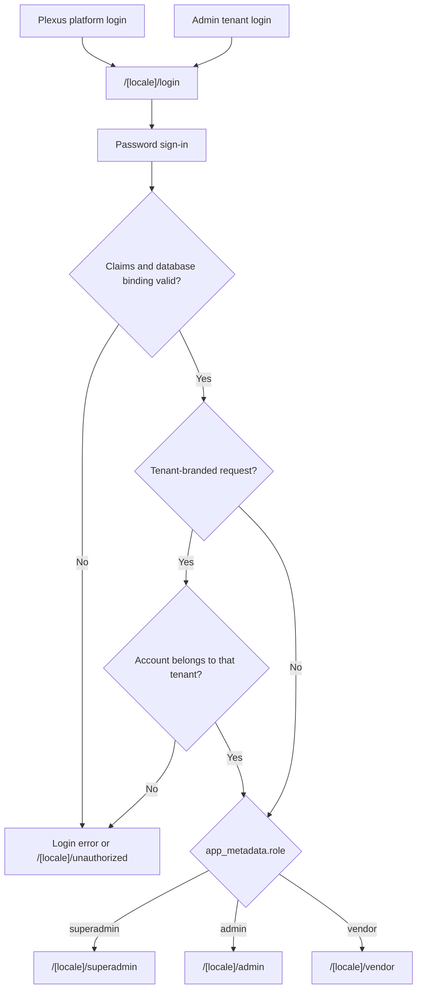

# Routes and Access

**Owner:** Engineering and security
**Review trigger:** Route, role, login, or provisioning change
**Last reviewed:** 2026-07-28

## Login routing

All roles use one email/password login with two presentation modes:

- The Plexus platform login at `/[locale]/login`.
- An active Admin tenant's white-label login through
  `/[locale]/login?tenant=<tenant-slug>` or `<tenant-slug>.plexus.com`.

The tenant mode displays the Admin tenant's name, logo, primary color, and
support contact. Tenant branding is resolved on the server and falls back to
the Plexus platform presentation when the requested tenant is invalid,
inactive, or unavailable.

Authenticated Superadmins and Admins can open
`/[locale]/login-preview?tenantId=<tenant-uuid>` to inspect the tenant
presentation without leaving their operator session. The preview disables
sign-in, Superadmins can inspect any tenant, and Admins can inspect only their
own tenant.



Public signup is disabled. Superadmins create Admins; Superadmins or the owning
Admin create Vendors.

Tenant-branded login accepts the owning Admin and Vendors bound to that Admin
tenant. It rejects Superadmins and accounts belonging to any other tenant. The
tenant slug is presentation and validation context only; it never grants a
role, tenant, or company scope.

## Password recovery

All roles can use the tenant-aware **Forgot password?** link:

1. `/{locale}/forgot-password` accepts an email address and always returns the
   same generic success response for valid email syntax.
2. Supabase Auth sends the recovery email without the application querying or
   revealing whether the account exists.
3. `/auth/callback` exchanges the one-time PKCE code for a cookie-backed
   recovery session. The callback accepts only localized
   `/{locale}/reset-password` destinations, preventing an open redirect.
4. `/{locale}/reset-password` requires a verified Supabase user session and
   updates only that signed-in Auth user's password.
5. The recovery session is signed out after the update, and the user returns
   to the matching tenant login to authenticate with the new password.

Production email delivery requires the approved application origin in
Supabase Auth Site URL/redirect settings and a production SMTP provider for
external Admin and Vendor recipients.

## Canonical public auth routes

| Route                       | Session requirement | Purpose                               |
| --------------------------- | ------------------- | ------------------------------------- |
| `/[locale]/login`           | None                | Shared role-directed login            |
| `/[locale]/forgot-password` | None                | Generic recovery-email request        |
| `/auth/callback`            | One-time Auth code  | PKCE recovery-session exchange        |
| `/[locale]/reset-password`  | Recovered user      | Update the recovered account password |

## Canonical protected routes

| Route                       | Allowed role      | Scope                               |
| --------------------------- | ----------------- | ----------------------------------- |
| `/[locale]/superadmin`      | Superadmin        | All tenants                         |
| `/[locale]/admin`           | Admin             | Own tenant                          |
| `/[locale]/admin/vendors`   | Admin             | Own tenant Vendors and users        |
| `/[locale]/login-preview`   | Superadmin, Admin | Any tenant or own tenant            |
| `/[locale]/vendor`          | Vendor            | Own company                         |
| `/[locale]/vendor/discover` | Vendor            | Eligible opposite-subtype directory |
| `/[locale]/compliance`      | Superadmin, Admin | Platform or own tenant              |

Root aliases such as `/login`, `/admin`, `/vendor`, and `/superadmin` redirect
to English. Legacy `/delegation` and `/partner` routes are compatibility
aliases for the Vendor workspace.

Public login and missing-route interfaces do not enumerate protected portal
paths. The route table above is internal engineering documentation.

## Trusted claim contract

```json
{ "role": "superadmin" }
```

```json
{ "role": "admin", "admin_id": "<tenant-uuid>" }
```

```json
{
  "role": "vendor",
  "admin_id": "<tenant-uuid>",
  "vendor_company_id": "<vendor-uuid>",
  "vendor_type": "delegation"
}
```

A Vendor type may be `delegation` or `partner`. Claims are rejected when they
do not exactly match an active `user_profiles` row, active Admin tenant, and
active Vendor company.

## Account provisioning

### Superadmin creates Admin

1. Create `admin_tenants`.
2. Create a confirmed Supabase Auth user through the server-only Admin API.
3. Set trusted Admin claims in `app_metadata`.
4. Create the matching active `user_profiles` record.
5. Roll back the tenant/Auth user if a later step fails.
6. Audit the privileged change.

### Admin creates Vendor

1. Verify the Admin is active and provisioning is enabled.
2. Restrict the requested `admin_id` to the Admin's own tenant.
3. Create the canonical `vendor_companies` identity.
4. Create the subtype record in `delegation_companies` or
   `partner_companies`.
5. Create a confirmed Auth user with trusted Vendor claims.
6. Create the exact active `user_profiles` binding.
7. Roll back partial records on failure and audit the change.

The Admin currently supplies the Vendor's initial login email and temporary
password. Self-service recovery is available after provisioning; invitation
and first-time password-setup flows remain planned work.

### Superadmin sends an Admin recovery link

1. Verify the caller is an authenticated Superadmin.
2. Re-read the target `user_profiles` row and require an active `admin` role
   with an Admin tenant binding.
3. Resolve the tenant slug on the server and build the approved
   tenant-aware `/auth/callback` redirect.
4. Record the privileged recovery request in `audit_events` before delivery,
   without storing the email address or recovery token in audit values.
5. Ask Supabase Auth to email the standard one-time recovery link. The
   Superadmin never sees or sets the Admin's password.

## Enforcement layers

| Layer                   | Responsibility                                                  |
| ----------------------- | --------------------------------------------------------------- |
| Proxy                   | Require session and route-compatible claim shape                |
| Server page/data loader | Validate active relational bindings                             |
| Server Action/API       | Authorize the requested operation and tenant                    |
| PostgreSQL RLS          | Restrict rows even if an application check is bypassed          |
| Constraints/triggers    | Prevent invalid or direct authorization rebinding               |
| Audit                   | Record privileged tenant, account, Vendor, and settings changes |

UI visibility is convenience only; it is never the authorization boundary.

## Tenant logo upload

`POST /api/tenant-branding/logo` accepts a multipart logo from an authenticated
Superadmin or Admin. Admins are restricted to their own tenant. The handler
requires a valid PNG, JPEG, or WebP file signature, enforces the 2 MiB limit,
stores the object under the tenant UUID in the public `tenant-branding` bucket,
and updates `admin_tenants.logo_url`. If the database update fails, the new
object is removed; after success, a previous application-owned logo is removed.
