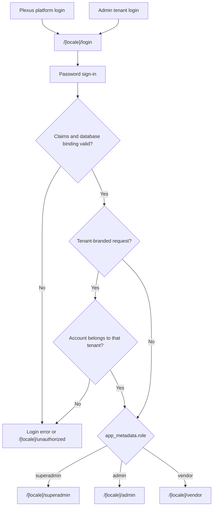

# Routes and Access

**Owner:** Engineering and security
**Review trigger:** Route, role, login, or provisioning change
**Last reviewed:** 2026-07-28

## Login routing

All roles use one email/password login with two presentation modes:

- The Plexus platform login at `/[locale]/login`.
- An active Admin tenant's white-label login through
  `/[locale]/login?tenant=<tenant-slug>` or `<tenant-slug>.plexus.com`.

The tenant mode displays the Admin tenant's name, logo, primary color, and
support contact. Tenant branding is resolved on the server and falls back to
the Plexus platform presentation when the requested tenant is invalid,
inactive, or unavailable.



Public signup is disabled. Superadmins create Admins; Superadmins or the owning
Admin create Vendors.

Tenant-branded login accepts the owning Admin and Vendors bound to that Admin
tenant. It rejects Superadmins and accounts belonging to any other tenant. The
tenant slug is presentation and validation context only; it never grants a
role, tenant, or company scope.

## Canonical protected routes

| Route                       | Allowed role      | Scope                               |
| --------------------------- | ----------------- | ----------------------------------- |
| `/[locale]/superadmin`      | Superadmin        | All tenants                         |
| `/[locale]/admin`           | Admin             | Own tenant                          |
| `/[locale]/admin/vendors`   | Admin             | Own tenant Vendors and users        |
| `/[locale]/vendor`          | Vendor            | Own company                         |
| `/[locale]/vendor/discover` | Vendor            | Eligible opposite-subtype directory |
| `/[locale]/compliance`      | Superadmin, Admin | Platform or own tenant              |

Root aliases such as `/login`, `/admin`, `/vendor`, and `/superadmin` redirect
to English. Legacy `/delegation` and `/partner` routes are compatibility
aliases for the Vendor workspace.

Public login and missing-route interfaces do not enumerate protected portal
paths. The route table above is internal engineering documentation.

## Trusted claim contract

```json
{ "role": "superadmin" }
```

```json
{ "role": "admin", "admin_id": "<tenant-uuid>" }
```

```json
{
  "role": "vendor",
  "admin_id": "<tenant-uuid>",
  "vendor_company_id": "<vendor-uuid>",
  "vendor_type": "delegation"
}
```

A Vendor type may be `delegation` or `partner`. Claims are rejected when they
do not exactly match an active `user_profiles` row, active Admin tenant, and
active Vendor company.

## Account provisioning

### Superadmin creates Admin

1. Create `admin_tenants`.
2. Create a confirmed Supabase Auth user through the server-only Admin API.
3. Set trusted Admin claims in `app_metadata`.
4. Create the matching active `user_profiles` record.
5. Roll back the tenant/Auth user if a later step fails.
6. Audit the privileged change.

### Admin creates Vendor

1. Verify the Admin is active and provisioning is enabled.
2. Restrict the requested `admin_id` to the Admin's own tenant.
3. Create the canonical `vendor_companies` identity.
4. Create the subtype record in `delegation_companies` or
   `partner_companies`.
5. Create a confirmed Auth user with trusted Vendor claims.
6. Create the exact active `user_profiles` binding.
7. Roll back partial records on failure and audit the change.

The Admin currently supplies the Vendor's login email and password. Invitation,
password-setup, and recovery email flows remain planned work.

## Enforcement layers

| Layer                   | Responsibility                                                  |
| ----------------------- | --------------------------------------------------------------- |
| Proxy                   | Require session and route-compatible claim shape                |
| Server page/data loader | Validate active relational bindings                             |
| Server Action/API       | Authorize the requested operation and tenant                    |
| PostgreSQL RLS          | Restrict rows even if an application check is bypassed          |
| Constraints/triggers    | Prevent invalid or direct authorization rebinding               |
| Audit                   | Record privileged tenant, account, Vendor, and settings changes |

UI visibility is convenience only; it is never the authorization boundary.
