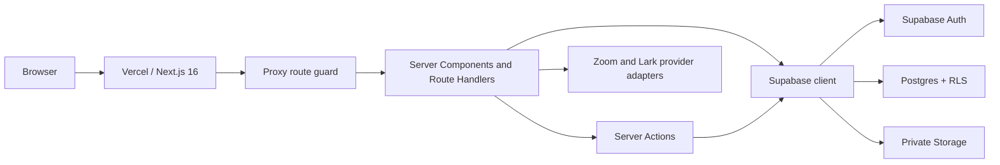
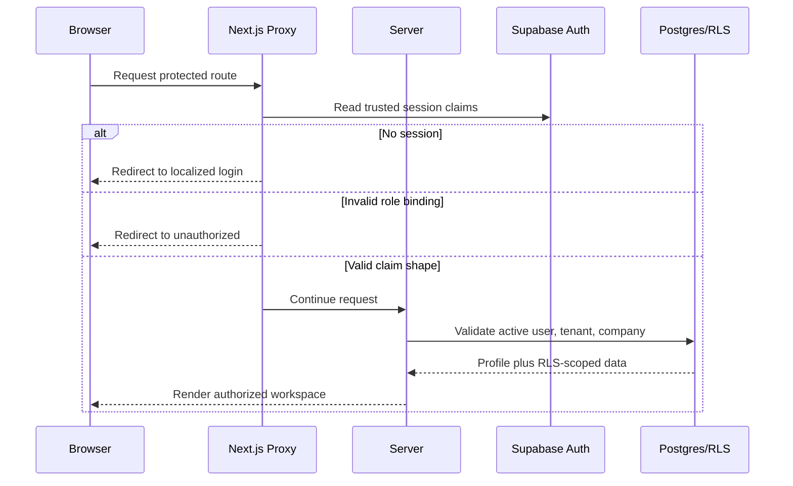

# System Architecture

**Owner:** Engineering
**Review trigger:** Module boundary, runtime, provider, or data-flow change
**Last reviewed:** 2026-07-28

## Runtime architecture

- Next.js App Router provides public pages, localized portals, route handlers,
  Server Components, and Server Actions.
- Supabase provides identity, PostgreSQL, Row Level Security, and private file
  storage.
- Vercel provides builds, serverless runtime, aliases, environment variables,
  and deployments.
- External services are accessed only through server-side adapters.

## Trust boundaries

1. The browser is untrusted.
2. Supabase `user_metadata`, form values, query strings, and route parameters
   never grant authorization.
3. Trusted role bindings live in Supabase Auth `app_metadata` and must exactly
   match active relational records.
4. Server route checks and database RLS both enforce scope.
5. `SUPABASE_SECRET_KEY` is server-only and used only for privileged account
   administration.

## Module map

| Module                   | Routes/UI                          | Server boundary             | Data                                             |
| ------------------------ | ---------------------------------- | --------------------------- | ------------------------------------------------ |
| Public shell             | Public routes, site header/footer  | Server-rendered pages       | Static content                                   |
| Identity/tenancy         | Login, Superadmin, Admin           | Auth and management actions | Auth, tenants, profiles, Vendors                 |
| Vendor onboarding        | Vendor workspace                   | Plexus actions              | Vendor and subtype profiles                      |
| Matching                 | Vendor discovery, Admin operations | Plexus actions              | Candidate directory, matches                     |
| Meetings/deals           | Portals, `/api/meetings`, `/m/*`   | `lib/meetings.ts`           | Matches, meetings, protected links, tokens       |
| Event operations         | Admin/Vendor portals               | Plexus actions              | Itineraries, site visits, liaison                |
| Communications/resources | Admin APIs and portals             | Protected route handlers    | Announcements, notifications, resources, Storage |
| Compliance               | Protected compliance routes        | Compliance adapter          | Provider responses, no secret in client          |
| Governance               | Superadmin console                 | Management actions          | Settings and audit events                        |

## Request lifecycle

## Superapp module contract

Every new module must document and implement:

| Contract area | Required answer                                                       |
| ------------- | --------------------------------------------------------------------- |
| Outcome       | Which user problem and metric does it own?                            |
| Owner         | Who approves behavior and operates it?                                |
| Routes        | Which public/protected routes and APIs exist?                         |
| Authorization | Which roles, tenants, companies, and actions are allowed?             |
| Data          | Which tables, migrations, constraints, and retention rules apply?     |
| Interface     | Which server actions/services are the stable boundary?                |
| Events        | What important domain events are emitted or consumed?                 |
| Integrations  | Which providers, credentials, timeouts, retries, and fallbacks exist? |
| UX            | Which empty, loading, error, mobile, and locale states exist?         |
| Quality       | Which unit, RLS, integration, E2E, and manual tests prove it?         |
| Operations    | How is it monitored, supported, disabled, and recovered?              |
| Documentation | Which product, schema, runbook, and changelog entries change?         |

Use [Feature plan](../templates/feature-plan.md) to capture the contract.
The secure provider workflow is recorded in
[Secure meeting links](../project-management/secure-meeting-links.md).

## Dependency direction

- UI components may call typed Server Actions or protected route handlers.
- Server Actions may use domain libraries and Supabase clients.
- Domain libraries must not import UI components.
- Browser code must not import the Supabase Admin client.
- Modules may read another module through a stable service/query boundary;
  avoid direct cross-module mutation.
- Shared UI primitives stay in `components/ui/`.

## Evolution path

The current application is a modular monolith. That is the preferred shape
until scaling evidence requires separation. Before extracting a service:

1. Establish a stable module interface.
2. Make ownership and data boundaries explicit.
3. Add idempotent events or an outbox where asynchronous work is needed.
4. Add provider-independent integration adapters.
5. Measure the operational reason for extraction.

Do not split services solely to make the system appear more like a superapp.
