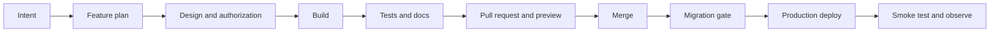

# Development Workflow

**Owner:** Engineering
**Review trigger:** Branch, review, verification, or delivery-process change
**Last reviewed:** 2026-08-26

## Start every session

```bash
nvm use
npm ci
npm run whereami
git status
```

Never assume the current branch, push remote, database project, or Vercel
target.

Open the [Plexus Development Command Center](plexus-command-center.html) before
framing meaningful work. Use it as the core visual review, then follow its
links to the canonical documents for detailed product, architecture, security,
delivery, and operational claims.

## Branch workflow

```bash
git switch main
git pull --ff-only
git switch -c feature/short-description
```

Keep unrelated local work out of the branch and pull request. Do not develop
directly on `main`.

## Delivery lifecycle



### 1. Frame

- Review the command center for current posture, priorities, architecture, and
  production-honesty boundaries.
- State the user outcome and measurable acceptance criteria.
- Identify the owning module and owner.
- Identify data, authorization, provider, and operational impact.
- Copy [Feature plan](../templates/feature-plan.md) when the change is more
  than a small fix.

### 2. Design

- Review [System architecture](../architecture/system-overview.md).
- Define role and tenant rules before UI work.
- Create an ADR for a durable architectural trade-off.
- Define failure, empty, loading, mobile, and locale behavior.

### 3. Build

- Keep browser, server, domain, and data boundaries explicit.
- Validate input at the server boundary.
- Use migrations for schema changes.
- Keep provider credentials and privileged clients server-only.

### 4. Verify

```bash
npm run docs:check
npm run verify:release
```

Add `npm run test:rls` for authorization/schema work and `npm run test:e2e`
for route, login, responsive, or workflow changes.

Re-open the command center before handoff. If the change affects any displayed
claim, update its editorial `PLEXUS` data together with the owning canonical
document. Run `npm run docs:command-center` after adding, removing, or moving a
Markdown file or App Router route; `npm run docs:check` rejects a stale
inventory.

### 5. Review and release

- Update `CHANGELOG.md`.
- Push only to `origin`.
- Review CI and Preview.
- Review `npm run supabase:plan` when migrations changed.
- Merge into `main`.
- Apply required migrations before dependent application code is promoted.
- Smoke-test the production URL and inspect errors.

## Database workflow

```bash
npx supabase migration new short_description
npm run test:rls
npm run supabase:plan
```

The migration, schema documentation, RLS tests, and changelog belong in the
same change. Applied migrations are immutable; use a forward-fix migration.

## Documentation workflow

Update the layer that owns the changed claim:

- Product outcome or scope: `docs/product/`
- Module/data flow: `docs/architecture/`
- Setup or conventions: `docs/development/`
- Priority or delivery process: `docs/project-management/`
- Test evidence: `docs/quality/`
- Release/support procedure: `docs/operations/`
- Authorization/secrets/privacy: `docs/security/`
- Durable live state: `docs/reference/project-status.md`

Then run `npm run docs:check`.

## Commit and pull-request standard

- Commit messages describe the delivered outcome.
- Every PR contains one coherent change.
- The PR explains user, data, security, and operational impact.
- No secret, credential, production data, `.env.local`, or `.vercel` state is
  committed.
- The [Definition of Done](../quality/definition-of-done.md) is satisfied.
