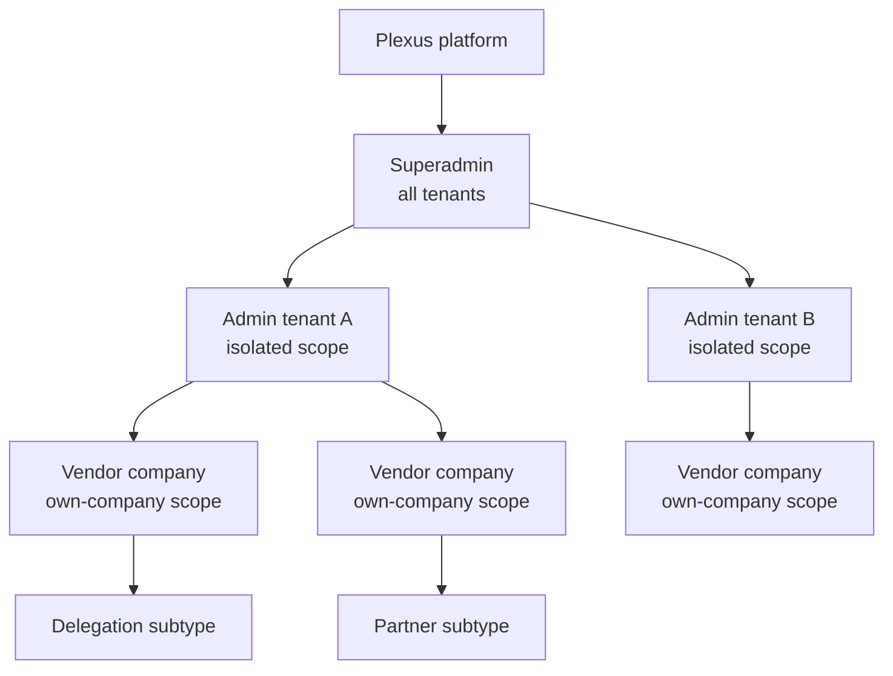
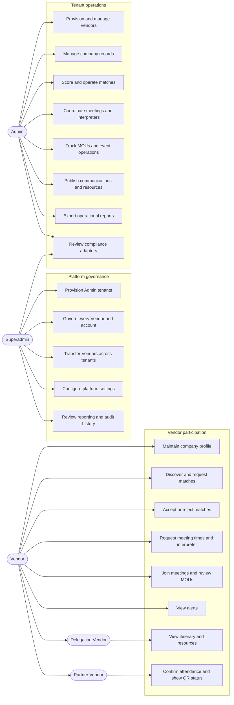
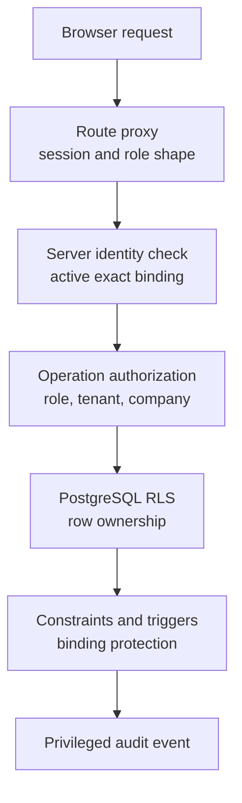

# Application Features by Role and Use Case

**Owner:** Product and engineering
**Review trigger:** Role, route, permission, workflow, or capability-status change
**Last reviewed:** 2026-07-28

## Purpose and scope

This guide explains the current Plexus application through its three
authorization layers:

1. **Superadmin** operates the whole Plexus platform.
2. **Admin** operates one isolated tenant and the Vendors assigned to it.
3. **Vendor** operates one company within an Admin tenant.

A Vendor has either a `delegation` or `partner` subtype. These subtypes change
the Vendor workspace and business workflows; they are not separate
authorization roles.

This is a current-state guide, not a future-product promise. Application code,
database migrations, and Row Level Security (RLS) remain the source of truth
when behavior changes.

## Capability status legend

| Status                | Meaning                                                                                                 |
| --------------------- | ------------------------------------------------------------------------------------------------------- |
| **Live**              | Persisted in Supabase and protected by application authorization and RLS                                |
| **Controlled**        | Live, but requires approved users or a manual operational step                                          |
| **Adapter**           | The interface and data contract exist, but a production provider or end-to-end automation is incomplete |
| **Simulation**        | The screen demonstrates an operational step without completing a real external action                   |
| **Planned / concept** | Product direction only; not an available production workflow                                            |

## Role hierarchy and scope

The hierarchy describes data and governance scope, not automatic UI
inheritance. For example, a Superadmin has platform-wide authority and
reporting, but the Superadmin control center does not reproduce every screen in
the Admin operations portal.

## Role summary

| Role       | Primary outcome                                                                                     | Data scope                                         | Main workspace         |
| ---------- | --------------------------------------------------------------------------------------------------- | -------------------------------------------------- | ---------------------- |
| Superadmin | Govern Plexus, its tenants, accounts, settings, and cross-tenant operations                         | All tenants and platform records                   | `/[locale]/superadmin` |
| Admin      | Run a branded tenant, manage its Vendors, and operate its business program                          | Own Admin tenant                                   | `/[locale]/admin`      |
| Vendor     | Maintain one company profile and participate in matching, meetings, agreements, and event workflows | Own company and explicitly shared workflow records | `/[locale]/vendor`     |

All roles use the same email/password login. Trusted Supabase Auth
`app_metadata` determines the role and bindings, after which the user is sent
to the correct workspace. All roles can request a self-service recovery email,
set a new password through a verified Supabase session, and return to the
correct tenant-branded login. Public self-signup is disabled.

## Use-case overview

## Feature and permission matrix

| Capability                                               | Superadmin                                           | Admin                                                                      | Vendor                                                              |
| -------------------------------------------------------- | ---------------------------------------------------- | -------------------------------------------------------------------------- | ------------------------------------------------------------------- |
| Shared login, role routing, logout                       | Own account                                          | Own account                                                                | Own account                                                         |
| Self-service password recovery                           | Own account                                          | Own account                                                                | Own account                                                         |
| Account profile settings                                 | No dedicated self-service panel                      | Edit own display name; manage branding and access from one settings dialog | Edit own display name and review access                             |
| Admin tenant creation                                    | All tenants                                          | No                                                                         | No                                                                  |
| Tenant profile and branding                              | Upload logo, edit, and preview every tenant          | Upload logo, edit, and preview own tenant                                  | View applied workspace context                                      |
| Tenant activation, suspension, archiving                 | Every tenant                                         | No                                                                         | No                                                                  |
| Vendor account provisioning                              | Any active tenant                                    | Own active tenant, when platform setting permits                           | No                                                                  |
| Vendor company status and directory                      | Every tenant                                         | Own tenant                                                                 | Own profile through Vendor workflow                                 |
| Vendor cross-tenant transfer                             | Yes                                                  | No                                                                         | No                                                                  |
| Account suspension/restoration and claim synchronization | All permitted accounts; cannot self-suspend          | Vendor accounts in own tenant                                              | No                                                                  |
| Admin password recovery link                             | Send to an active Admin account from its tenant row  | Self-service only                                                          | No                                                                  |
| Platform settings                                        | Read/write                                           | Reads the Vendor-provisioning permission used by its workflow              | No                                                                  |
| Privileged audit history                                 | Platform-wide, latest 200 shown                      | Own tenant, latest 100 shown                                               | No                                                                  |
| Operational tenant reporting                             | Cross-tenant totals                                  | Full own-tenant dashboard and reports                                      | Own-company summaries                                               |
| Delegation and Partner records                           | Platform directory/reporting                         | Create, view, update, and delete within own tenant                         | Update own registration profile                                     |
| Match discovery                                          | No dedicated Superadmin UI                           | Manages own-tenant matching board                                          | Opposite-subtype directory; limited fields only                     |
| Match status and scoring                                 | No dedicated Superadmin UI                           | Propose, score, and operate own-tenant matches                             | Request and record only its own acceptance/change decision          |
| Meetings                                                 | Cross-tenant critical incidents and controlled retry | Monitor automatically created sessions                                     | Second acceptance creates the default provider; join through Plexus |
| Interpreter roster                                       | No dedicated Superadmin UI                           | Create, edit, set availability, delete, and assign                         | Request an available preferred interpreter                          |
| MOU/deal tracking                                        | Cross-tenant reporting                               | Track status, signatory check, mark signed, preview/download available PDF | View own MOU status and preview/download available PDF              |
| Communications                                           | No dedicated Superadmin UI                           | Create targeted announcements and in-app notifications                     | View applicable operational notifications                           |
| Documents and resources                                  | No dedicated Superadmin UI                           | Add URL resources, upload private files, set audience and visibility       | Delegation subtype can view permitted resources                     |
| Event attendance and check-in                            | Cross-tenant reporting only                          | Manual/QR check-in simulation for tenant Partners                          | Partner subtype confirms attendance and sees QR status              |
| Itinerary, site visits, liaison                          | Cross-tenant reporting only                          | Publish itinerary; view site visits and liaison records                    | Delegation subtype views published itinerary                        |
| CSV/ICS exports                                          | Reporting on screen                                  | Pre-visit CSV, post-event CSV, and meeting calendar ICS                    | Meeting ICS; Delegation itinerary CSV                               |
| Compliance console and APIs                              | Platform access                                      | Own authenticated access                                                   | No                                                                  |

Database RLS narrows Admin and Vendor actions to their permitted rows even
where a shared Server Action supports more than one role.

## Superadmin features

### Platform dashboard

**Status: Live**

- View counts for Admin tenants, active tenants, Vendors, active Vendors,
  accounts, suspended accounts, matches, meetings, and deals.
- Access the Compliance console.
- See a warning when the server-only Supabase administration credential is not
  configured. Directory and reporting access remain available, while
  privileged Auth account operations are locked.

### Admin tenant lifecycle

**Status: Controlled**

- Create an Admin tenant and its first Admin login.
- Capture tenant name, slug, support email, Admin display name, login email,
  and temporary password.
- Explain that the support email is the tenant-facing help contact while the
  Admin email is the first operator's private login and recovery identity.
- Require the temporary password to be entered twice and match before
  provisioning is submitted.
- Create a confirmed Supabase Auth account with trusted Admin claims and a
  matching active database profile.
- Edit tenant name, support email, and primary brand color.
- Upload a PNG, JPEG, or WebP login logo directly to tenant-scoped Supabase
  Storage, with an advanced HTTPS URL fallback for existing assets.
- Preview the tenant login presentation in an authenticated, sign-in-disabled
  browser tab before sharing the public tenant login.
- Change tenant state between `active`, `suspended`, and `archived`.
- View the number of Vendors assigned to each tenant.
- Roll back partial provisioning when a later creation step fails.

Temporary password delivery remains a controlled manual process.
Self-service password recovery is live; invitation and first-time password
setup flows are planned. A Superadmin can also send an audited, tenant-aware
password recovery link to an active Admin account without viewing or replacing
the password.

### Global Vendor governance

**Status: Live / Controlled**

- View Vendors across every Admin tenant.
- Search by company name or sector.
- Filter by owning Admin tenant and by Delegation/Partner subtype.
- Provision a Vendor company and confirmed Vendor Auth account in any active
  tenant.
- Edit full company, subtype, business-contact, account-holder, and login-email
  details while keeping the tenant and Vendor subtype binding protected.
- Change Vendor state between `active`, `suspended`, and `archived`.
- Transfer a Vendor, its users, and tenant-owned workflow records to another
  active Admin tenant through an audited operation.

### Account governance

**Status: Controlled**

- View account role, Admin binding, Vendor binding, and active state.
- Suspend or restore permitted accounts in both the database profile and
  Supabase Auth.
- Synchronize trusted Auth claims from the canonical database binding.
- Send a Supabase password recovery link to an active Admin from its tenant
  control row; the link returns to that tenant's branded password-reset flow.
- Prevent a Superadmin from suspending its own account through this control.
- Revert claim changes when mandatory audit logging fails.
- Record the recovery request before email delivery without storing the email
  address or recovery token in audit values.

### Reporting

**Status: Controlled**

- Compare each tenant's Vendor, match, meeting, and deal totals.
- Review platform-wide operational record totals.
- Use the report to identify tenant activity and operational coverage.

### Platform settings

**Status: Live**

- Maintain the default Admin plan.
- Enable or disable Admin-side Vendor account provisioning.
- Maintain supported-market reference data.
- Publish a platform operations notice.
- Store settings as JSON values or strings and record the updating user.

### Audit events

**Status: Live**

- Review the latest 200 privileged events across the platform.
- Search by action, table, role, or target identifier.
- Inspect actor, tenant, target, before/after values, request ID, and timestamp
  when recorded.
- Rely on append-only access for normal application roles.

### Critical meeting incidents

**Status: Live**

- Receive a prominent critical alert when automatic Zoom or Lark meeting
  creation fails after both Vendors have accepted a match.
- Review the affected tenant, match, provider, attempt count, and a sanitized
  failure category without exposing credentials or provider responses.
- Retry the failed meeting creation from the Superadmin console while
  preserving the Vendors' accepted match.

### Compliance readiness

**Status: Adapter**

- View World-Check, Malaysia SSM, and CTOS configuration status.
- Review supported markets and the normalized screening payload.
- Access protected vendor-status and screening APIs.
- Run World-Check for configured markets and conditionally run SSM/CTOS for
  Malaysian companies after provider credentials are configured.

The current console is an integration-readiness view; it is not a complete
case-management or compliance-decision product.

## Admin features

### Tenant dashboard and settings

**Status: Live**

- Open a compact account-settings workspace with separate Profile, White
  label, and Access sections; edit the signed-in display name without exposing
  internal user or tenant UUIDs.
- Review the human-readable account role and workspace, change portal language,
  start self-service password recovery, or end the current session.
- View own-tenant totals, fully matched Delegations, invited/arrived guests,
  signed MOUs, scheduled/completed meetings, conversion, notifications, and a
  phase timeline.
- Keep the Admin dashboard focused on operating metrics and workflow cards
  without internal tenancy or persistence notices.
- Review the current session queue and mark a meeting complete.
- Edit the tenant name, support email, login logo, and primary color, then open
  an authenticated login-page preview without leaving account settings.
- Reuse the saved white-label logo in the Admin account control and account
  settings identity panel, with the operator's initials as the fallback.
- Open Vendor accounts and Compliance from the Admin sidebar; retain the same
  responsive sidebar and active destination on the Vendor accounts route, with
  a near-full-width phone drawer and 48-pixel primary navigation touch targets;
  start provisioning there and manage tenant branding from account settings.
- Export a pre-visit report directly from the dashboard.

### Vendor and Vendor-account management

**Status: Controlled**

- Provision Delegation or Partner Vendors only inside the Admin's own active
  tenant, when platform Vendor provisioning is enabled.
- View Vendor subtype, sector, linked account count, and status.
- Edit company names, size, subtype-specific profile, primary contact, linked
  account-holder name, and login email. Select the sector from a searchable
  UN ISIC Revision 5 directory covering every global section and division;
  existing custom values remain visible until replaced. Login-email changes
  update the server-managed authentication identity without changing the
  password.
- Activate, suspend, or archive a Vendor company.
- Suspend or restore Vendor user accounts.
- Synchronize Vendor Auth claims with their database bindings.
- Review the latest 100 tenant audit events.

The Admin cannot create other Admins, transfer Vendors to another tenant, or
change platform settings.

### Company operations

**Status: Live**

- View separate Delegation and Malaysian Partner directories.
- Search records by company name, sector, origin/type, or status.
- Review profile completion, readiness, attendance, verification, and matching
  coverage metrics.
- Create, edit, inspect, and delete operational Delegation and Partner records
  within tenant scope. Select sectors from the same UN ISIC Revision 5
  directory used by Vendor accounts; the operational directory follows the
  saved sector and falls back to the Vendor's submitted profile sector for
  legacy records instead of presenting `Pending profile` as an industry.
- Inspect the full structured registration profile for a company.

Each Vendor edits only the company bound to the signed-in account, so the
profile does not expose an account selector. The form shows a live,
validation-aware completion percentage, lets Vendors collapse each registration
section, and validates year, URL, email, phone, introduction, and consent-date
formats in both the browser and the Server Action before persistence.

Account provisioning and operational company-record management are distinct
workflows. Use the Vendor provisioning control when the company needs a login.

### Matching

**Status: Live**

- Select a Delegation and rank Partner candidates using sector, needs,
  offerings, verification, and profile-completeness signals.
- View predicted fit percentages.
- Assign a Partner to create a proposed match.
- Track `Proposed`, `Accepted`, `Rejected`, and `Session Scheduled` states.
- Wait for each participating Vendor to record its own acceptance; the second
  acceptance automatically creates the configured provider meeting. Admins
  cannot accept on a Vendor's behalf.
- Prevent duplicate Vendor-requested matches.

The score is an operational matching aid, not an autonomous approval or due
diligence decision.

### Meetings and interpreters

**Status: Live data model / Adapter deployment pending**

- Open a dedicated meeting-operations dashboard from the Admin sidebar.
- Review total, scheduled/live, completed, and booked-time metrics even when
  the tenant has no meetings yet.
- View the complete tenant-scoped meeting list and calendar, including
  completed and cancelled sessions.
- Review company pair, date/time, duration, platform, host, interpreter,
  meeting status, agreement status, and summary.
- Open any calendar entry or meeting-list row in a responsive details dialog.
  Admins can amend a future unlinked meeting's time, duration, Zoom/Lark
  preference, interpreter, and agenda. Vendor pairing is immutable; meetings
  with protected links keep provider, date, and duration locked while still
  allowing agenda and interpreter changes. Completed and cancelled meetings
  are read-only.
- Copy the protected Plexus join link from the meeting row or details dialog
  once it is ready. The copy control remains disabled while acceptance or
  provider creation is pending and never exposes the raw Zoom/Lark URL.
- Manually select one delegation Vendor and one Malaysian partner, set a future
  time, Zoom or Lark preference, duration, interpreter, and agenda, and add the
  meeting to both Vendor calendars. Plexus creates or reuses the tenant-scoped
  match, rejects rejected pairs and duplicate times, and keeps the provider
  link pending until both Vendors accept. Compact company names in the closed
  selectors prevent long sector labels from colliding with adjacent fields.
- Review truthful Zoom and Lark readiness plus protected-link readiness in
  Meeting settings. `Online` means the required server configuration,
  protected-link origin, and provider authorization are present; the provider
  API is validated again when a meeting is created.
- Keep provider credentials and Lark authorization platform-managed while
  allowing tenant Admins to inspect readiness without viewing secrets.
- Export the tenant meeting calendar as an `.ics` file.
- Monitor the Zoom or Lark meeting created automatically after both Vendors
  accept.
- Join through an opaque Plexus link; never display the provider URL.
- Mark a meeting complete and save the current fixed completion summary.
- Create, edit, set availability for, and delete interpreters.
- Review Vendor interpreter preferences and assign or clear the confirmed
  interpreter.

Provider creation, the secure link gate, durable critical incidents, and
Superadmin retry are implemented in source. The Vercel credential setup,
migration application, one-time Lark authorization, and live Zoom/Lark smoke
tests remain release steps. Provider rescheduling, cancellation, reminders,
and reconciliation remain future work.

### MOU and deal tracking

**Status: Live tracking / Adapter document lifecycle**

- Track `Under Discussion`, `Agreement Reached`, `Signed`, and `Failed` states.
- View signatory-check status.
- Mark a deal signed.
- Preview, open, or download a PDF when a matching public document is present.

E-signature, collaborative review, secure deal-document upload, and provider
status reconciliation are not yet complete.

### Communications

**Status: Live data model / Adapter delivery**

- Target all participants, Delegations, Partners, or the Admin team.
- Select email, in-app notification, or both.
- Queue an announcement or mark it sent.
- Write in-app notifications immediately.
- Review the tenant announcement log and its audience, channel, and status.
- Use the protected Admin communications API.

Email records can be queued, but transactional email delivery is not connected
to a production provider.

### Documents and resources

**Status: Live**

- Add a resource using an existing URL.
- Upload PDF, DOCX, PPTX, PNG, JPEG, or WebP files up to 15 MiB.
- Store uploaded files in a private Supabase Storage bucket.
- Categorize resources as agenda, map, briefing, logistics, or other.
- Set the audience to all, Delegation, Partner, or Admin.
- Toggle Delegation-portal visibility.
- Open files through an authenticated route and a short-lived signed URL.

### On-site operations

**Status: Mixed**

- **Guest check-in — Simulation:** View invited/arrived totals and perform a
  manual/QR-style Partner check-in that persists arrival status.
- **Itinerary — Live:** Publish or unpublish schedule slots for the Delegation
  workspace.
- **Site visits — Live read model:** View venue, date, time, escort, notes, and
  status. The current screen does not edit these records.
- **Official liaison — Live read model:** View government/official contacts,
  protocol notes, and readiness state. The current screen does not edit these
  records.

A production QR scanner, secure QR token validation, and on-site device flow
are not connected.

### Reports

**Status: Live**

- Export a UTF-8, Excel-ready pre-visit CSV with company pairs, fit scores,
  match states, meeting states/platforms, and notes.
- Export a post-event CSV with Partner sector, attendance, arrival,
  verification, and match counts.
- View headline session, signing, attendance, site-visit, and follow-up totals.

### Compliance

**Status: Adapter**

- View the same protected integration-readiness console available to
  Superadmins.
- Query provider configuration status.
- Submit validated screening requests through the protected backend API.
- Keep provider credentials and raw calls on the server.

## Vendor features

### Shared Vendor workspace

Both Vendor subtypes receive the following features, restricted to their own
company and workflow participation.

#### Dashboard

**Status: Live**

- View company/profile identity, profile-completion percentage, match summary,
  next meeting, and company-scoped profile, pending-match, upcoming-meeting,
  and active-MOU metrics.
- Receive tenant-scoped live updates when the company profile, participating
  matches, related meetings, or related MOU records change; the workspace also
  refreshes on focus/visibility and periodically recovers if Realtime is
  interrupted.
- See the Admin tenant's saved white-label name and logo across desktop and
  mobile Vendor navigation instead of platform branding.
- Keep infrastructure implementation details out of the Vendor dashboard.

#### Registration profile

**Status: Live**

- Maintain company name, country/region, establishment and registration data,
  website, address, employee range, and revenue range.
- Maintain the primary contact, position, email, mobile, chat ID, and preferred
  languages; mobile entry includes a searchable calling-code picker for every
  supported country and region and stores one international phone value.
- Record industries, company introduction, products/services, certifications,
  offerings, needs, preferred partner types, and expected outcomes.
- Describe the ideal partner, business opportunity, export experience, target
  markets, preferred meeting format, availability, and maximum meetings.
- Record supporting-document types and matchmaking consent.
- See a live validated answered/total counter beside every collapsible section
  so remaining questions are visible before opening it.
- Upload PDF supporting documents to the own-company private library, with
  signature validation and a 6 MiB file limit.
- Review an uploaded PDF through a short-lived authorized link.
- Permanently delete an uploaded PDF after explicit confirmation.
- Recalculate profile completeness on save.
- Update only the Vendor's own company profile.

#### Discovery and matching

**Status: Live**

- Browse companies of the opposite Vendor subtype.
- Keep the white-label Vendor workspace sidebar available while browsing the
  discovery directory, with **My matches** shown as the active section.
- Return directly to the Vendor's own match list from the discovery header
  while preserving the selected portal locale.
- Search by English name, Chinese name, or sector.
- See only the candidate ID, names, and sector; private profile/contact fields
  are not exposed by discovery.
- Request a match and receive a calculated fit score and note.
- Prevent duplicate requests for the same company pair.
- Review own matches with an explicit **Your company ↔ Linked Vendor**
  relationship, counterpart name/sector, match confidence, both decisions, and
  a details action that never exposes the counterpart's private profile or
  contact fields.
- Record only its own acceptance. The match remains `Proposed` until the other
  participating Vendor also accepts.
- Use **Request change**, which records the `Rejected` state and clears the
  requesting Vendor's acceptance.

#### Meeting request and participation

**Status: Live preferences / Adapter deployment pending**

- Trigger automatic meeting creation when the second participating Vendor
  accepts.
- Use the platform-configured Zoom or Lark provider without waiting for an
  Admin creation action.
- View own scheduled meetings and stored summaries.
- Open the expiring Plexus link without receiving the raw provider URL.
- Download an individual `.ics` calendar invitation.

#### MOU access

**Status: Live tracking / Adapter document lifecycle**

- View deals connected to the Vendor's own matches.
- Review MOU status, signatory-check status, and document name.
- Preview, open, or download an available PDF.
- See a pending state when no PDF exists.

The Vendor workspace does not currently provide a functioning counter-signed
document upload or e-signature workflow.

### Delegation Vendor

**Status: Live**

In addition to the shared Vendor features, a Delegation Vendor can:

- View only published itinerary slots for the Malaysia visit.
- View resources whose audience is `all` or `delegation` and whose Delegation
  visibility is enabled.
- Open authorized resource files.
- Export the published itinerary to CSV.
- See the assigned coordinator and the number of accepted/scheduled matches
  toward the current two-match operating target.

### Partner Vendor

**Status: Live state / Simulation QR**

In addition to the shared Vendor features, a Partner Vendor can:

- View attendance state and event venue information.
- Confirm event attendance.
- Display a generated QR-style status identifier.
- See when the Admin has marked the company as arrived.

The displayed QR is not yet a production-secure credential, and the application
does not yet perform a real camera scan or external access-control check.

## Main business workflow

```mermaid
flowchart LR
    S["Superadmin provisions<br/>Admin tenant"] --> A["Admin provisions<br/>Vendor login"]
    A --> P["Vendor completes<br/>company profile"]
    P --> D["Vendor discovers<br/>opposite subtype"]
    D --> M["Vendor or Admin<br/>proposes match"]
    M --> C{"Both Vendors accepted?"}
    C -- "No" --> R["Reject / request change"]
    C -- "Yes" --> T["Vendor submits time<br/>and interpreter preferences"]
    T --> F["Admin confirms meeting<br/>and interpreter"]
    F --> J["Both Vendors join<br/>protected Plexus link"]
    J --> O["Admin records completion<br/>and MOU status"]
    O --> E["Admin publishes itinerary,<br/>resources and event operations"]
    E --> X["Partner confirms attendance;<br/>Admin checks in guest"]
    X --> Q["Admin exports<br/>pre/post-event reports"]
```

## Routes and access

| Route                                    | Access            | Purpose                                                 |
| ---------------------------------------- | ----------------- | ------------------------------------------------------- |
| `/[locale]/login`                        | Public            | Shared login and role-directed routing                  |
| `/[locale]/forgot-password`              | Public            | Generic password-recovery email request                 |
| `/auth/callback`                         | Public            | Supabase PKCE code exchange for a recovery session      |
| `/[locale]/reset-password`               | Recovery session  | Set a new password for the recovered account            |
| `/[locale]/superadmin`                   | Superadmin        | Platform control center                                 |
| `/[locale]/login-preview`                | Superadmin, Admin | Authenticated, sign-in-disabled tenant branding preview |
| `/[locale]/admin`                        | Admin             | Tenant operations portal                                |
| `/[locale]/admin/vendors`                | Admin             | Tenant Vendor and Vendor-account management             |
| `/[locale]/vendor`                       | Vendor            | Delegation or Partner company workspace                 |
| `/[locale]/vendor/discover`              | Vendor            | Opposite-subtype company discovery                      |
| `/[locale]/compliance`                   | Superadmin, Admin | Compliance integration readiness                        |
| `/[locale]/compliance/world-check`       | Superadmin, Admin | World-Check adapter status                              |
| `/[locale]/compliance/malaysia-ssm-ctos` | Superadmin, Admin | Malaysia SSM/CTOS adapter status                        |

Root aliases such as `/login`, `/admin`, `/vendor`, and `/superadmin` redirect
to English. Legacy `/delegation` and `/partner` paths redirect Vendor users to
the unified Vendor workspace.

The protected portal supports English (`en`), Simplified Chinese (`zh`),
Traditional Chinese (`zh-Hant`), and Thai (`th`). `cn` aliases to `zh`.

## Shared public application layer

The role-protected workspaces sit behind a public layer that includes:

- A public homepage and marketing pages for Vendors, businesses, how Plexus
  works, pricing, about, contact, help, and blog.
- Public privacy, terms, cookie, DPA, PDPA, and legal-information routes.
- Public marketing content in English, Bahasa Malaysia, and Traditional
  Chinese.
- Tenant-aware public branding based on a supported Plexus subdomain.
- A `/app` future-product showcase.

The `/app` showcase describes planned AI and trade-superapp concepts such as
Company Brain, live multilingual interpretation, Deal Radar, automated action
briefs, agreement drafting/e-signing, logistics, payments, and finance. It is a
concept experience and must not be read as the current protected application's
live feature set.

## Authorization and safety model

- The browser, URL parameters, form fields, and Supabase `user_metadata` are
  untrusted.
- Trusted role bindings live in Supabase Auth `app_metadata` and must exactly
  match an active `user_profiles` row.
- Admin access requires an active Admin tenant.
- Vendor access requires an active Vendor company with the exact Admin,
  company, and subtype binding.
- Proxy checks, server authorization, RLS, constraints, and audit controls work
  together; hiding a UI control is not treated as authorization.
- Vendors can read shared matches, meetings, and deals only when their own
  company participates.
- The event-resource bucket is private and file downloads are authorized
  through the resource metadata and signed URLs.
- Tenant login logos use the public `tenant-branding` bucket so they render
  before authentication; application authorization, tenant scoping, file-size
  limits, and image-signature validation protect uploads.

## Known gaps and planned capabilities

The following are not complete production features:

- Public signup.
- Invitation email, first-time password setup, automated credential delivery,
  and production SMTP/email branding.
- Production rollout and smoke verification of Zoom/Lark creation; provider
  update, cancellation, retry, and reconciliation.
- Production email and push-notification delivery.
- Secure MOU upload, collaborative review, e-signature, and document lifecycle.
- Production-secure QR generation and scanning.
- Complete compliance case management and configured provider coverage.
- Error tracking, uptime monitoring, product analytics, and alert ownership.
- The AI assistant and other `/app` future-superapp concepts.

See the [capability map](capability-map.md) and
[roadmap](../project-management/roadmap.md) for the maintained delivery status.

## Source references

- [Product vision and scope](vision-and-scope.md)
- [Superapp capability map](capability-map.md)
- [Routes and access](../architecture/routes-and-access.md)
- [System architecture](../architecture/system-overview.md)
- [Database schema](../architecture/database-schema.md)
- [Authorization and data security](../security/authorization-and-data-security.md)
- [Current project status](../reference/project-status.md)
