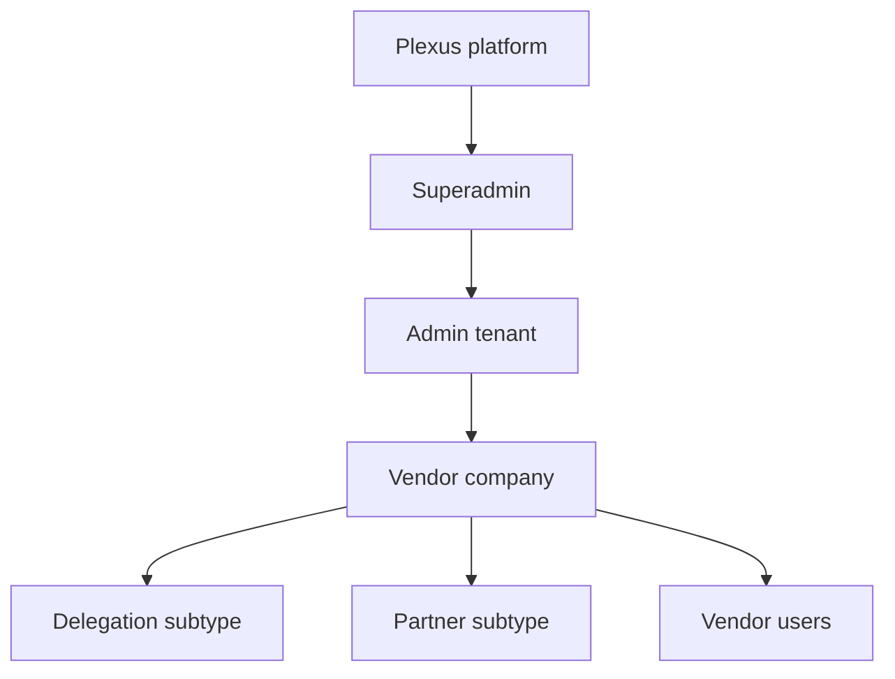

# Product Vision and Scope

**Owner:** Product
**Review trigger:** Product strategy, target market, or launch-scope change
**Last reviewed:** 2026-07-29

## Vision

Plexus is a configurable business operations superapp that helps platform
operators, regional partners, and participating companies move from onboarding
to qualified introductions, meetings, agreements, and ongoing collaboration in
one trusted workspace.

The initial operating context is Malaysia–China/Macao business matching. The
architecture must support more markets, programs, tenant brands, workflows, and
integrations without creating a new application for each program.

## User hierarchy

| Role       | Primary outcome                                              |
| ---------- | ------------------------------------------------------------ |
| Superadmin | Operate and govern the platform across all tenants           |
| Admin      | Run a branded, isolated tenant and manage its Vendors        |
| Vendor     | Maintain company data and participate in permitted workflows |

`delegation` and `partner` are Vendor subtypes, not independent authorization
roles.

## Product principles

1. **One identity, explicit scope.** Role and tenant access come from trusted
   bindings, never from email domains, URL parameters, or client state.
2. **Modular superapp.** Each business capability owns clear routes, data,
   permissions, tests, events, integrations, and runbooks.
3. **Human-governed automation.** AI and workflow automation assist operators;
   sensitive decisions remain reviewable and auditable.
4. **Tenant isolation by default.** Cross-tenant access is an explicit
   Superadmin capability.
5. **Progressive production.** Demo adapters are clearly labelled and replaced
   behind stable interfaces.
6. **Multilingual by design.** User-facing workflows support locale-aware copy
   and data presentation.
7. **Operational truth in the repository.** Schema, code, tests, runbooks,
   decisions, and delivery status change together.

## Current controlled-production scope

The deployed platform currently supports:

- Shared email/password authentication and role-directed routing.
- Superadmin tenant, Vendor, account, settings, reporting, and audit controls.
- Admin tenant operations and Vendor provisioning.
- Tenant-branded Vendor applications with Admin approval and one-time password
  setup.
- Vendor company registration profiles.
- Delegation/Partner discovery and matching.
- Meeting, deal, itinerary, liaison, interpreter, communication, notification,
  resource, site-visit, and compliance workflow surfaces.
- Strict Supabase tenant and company isolation.
- English, Simplified Chinese, Traditional Chinese, and Thai route locales.

Some workflow surfaces use placeholders or adapters that are not yet connected
to production providers. The [capability map](capability-map.md) distinguishes
live, controlled, adapter, and planned capabilities.

## Out of scope until explicitly planned

- Unreviewed public Auth self-signup or client-selected tenant/role binding.
- Client-side role or tenant selection.
- Unreviewed cross-tenant data sharing.
- A public plugin marketplace.
- Autonomous compliance, credit, legal, or deal decisions.
- Production claims for mocked email, meeting, signing, QR, or notification
  providers.

## Success measures

Product and delivery plans should attach measurable targets to:

- Vendor onboarding completion and time to completion.
- Qualified match acceptance rate.
- Time from onboarding to first accepted match and first meeting.
- Meeting completion and follow-up conversion.
- Tenant activation, retention, and operator workload.
- Cross-tenant authorization incidents: target zero.
- Release failure, rollback, and mean-time-to-recovery.
- User-visible error rate and Core Web Vitals.

## Scope decision rule

A new capability belongs in Plexus when it:

1. Supports a defined user outcome.
2. Fits an existing module or has a complete module contract.
3. Has an explicit tenant/data ownership model.
4. Has a production integration or is visibly labelled as a non-production
   adapter.
5. Has acceptance criteria, tests, operational ownership, and success metrics.
