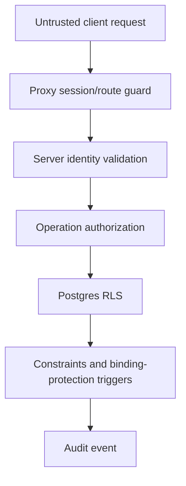

# Authorization and Data Security

**Owner:** Security and engineering
**Review trigger:** Auth, role, RLS, storage, secret, provider, or privacy change
**Last reviewed:** 2026-07-28

## Security objectives

- Prevent access across Admin tenants.
- Limit Vendors to their own company and explicitly shared workflow records.
- Prevent self-promotion or client-controlled authorization.
- Keep privileged credentials out of browser code and source control.
- Audit privileged lifecycle and binding changes.
- Fail closed when claims, profiles, tenants, or companies are missing/inactive.

## Trust model

Authorization uses trusted Supabase Auth `app_metadata`. `user_metadata` is
display-only and must never be used in RLS or access decisions.

| Role       | Required binding                                                    |
| ---------- | ------------------------------------------------------------------- |
| Superadmin | `role=superadmin`; no tenant/Vendor fields                          |
| Admin      | `role=admin`, valid `admin_id`                                      |
| Vendor     | `role=vendor`, valid `admin_id`, `vendor_company_id`, `vendor_type` |

Every request also validates an active `user_profiles` row with an exact claim
match. Admin/Vendor access requires active owning records.

## Defense in depth



No single UI or middleware check is treated as sufficient.

## RLS rules

- All public business tables have RLS enabled.
- `anon` has no business-table access.
- Policies target `authenticated` and add tenant/company predicates.
- `TO authenticated` alone is not authorization.
- Updates use both `USING` and `WITH CHECK`.
- Vendor access to matches, meetings, and deals requires participation by the
  Vendor's own company.
- Meeting-provider readiness is computed server-side and exposes only
  configuration/authorization states to the Admin UI. Zoom/Lark credentials,
  OAuth tokens, and raw provider meeting links remain server-only.
- Audit events are append-only to normal application roles.
- Direct changes to role, tenant, company, or subtype bindings are protected by
  constraints and triggers.

See the [database schema](../architecture/database-schema.md) for the live
policy summary.

## Privileged clients and secrets

- Browser/client code uses only the Supabase URL and publishable key.
- The publishable key is not a secret; RLS is the data boundary.
- `SUPABASE_SECRET_KEY` is server-only and Production-only in Vercel.
- The Supabase Admin client must never be imported by a Client Component.
- Secrets must not appear in Git, `.env.example`, logs, screenshots, issues, or
  user-visible errors.
- Rotate a credential when exposure is suspected; removing it from a file is
  not enough.

## Sessions and account state

- Role/binding changes require token refresh or sign-in before claims are
  trusted as current.
- Database active checks deny stale tokens for suspended accounts.
- Deleting an Auth user alone is not a complete session-revocation strategy.
- Sensitive account disablement should suspend relational access and revoke or
  expire sessions according to the current Supabase Auth policy.
- Public signup and anonymous sign-in remain disabled.
- Tenant-branded login slugs are untrusted context. After authentication, the
  server compares the requested active tenant with the account's trusted
  `admin_id`; a mismatch signs the user out and returns a generic error.
- Tenant branding is loaded server-side. It changes presentation only and does
  not participate in role or row-level authorization.

## Account provisioning

- Superadmin is bootstrapped through a guarded server-side process.
- Only Superadmin creates Admin tenants/accounts.
- Admin creates Vendors only in its own active tenant and only when platform
  provisioning is enabled.
- Provisioning uses the Auth Admin API and exact relational bindings.
- Admin provisioning validates the temporary password confirmation in both the
  browser and the Server Action before creating any tenant or Auth record.
- Partial failures roll back created Auth/database records.
- Temporary password delivery remains a controlled risk until invitation and
  first-time password setup flows are implemented.
- Public password-recovery requests return a generic response, the callback
  rejects non-reset destinations, and the password mutation requires a
  verified Supabase user session.

## Storage

The `event-resources` bucket is private. File access requires an authenticated,
authorized metadata record and server-mediated path.

The `vendor-profile-documents` bucket is also private. It accepts only PDF
objects up to 6 MiB. Both the metadata table and Storage policies independently
require an active actor and an exact tenant/company path match. The Vendor
handler validates extension, declared MIME type, and `%PDF-` signature,
sanitizes the filename, creates the tenant/company-prefixed path on the server,
and never returns that path to the browser. Review uses a 60-second signed URL.
Delete requires explicit UI confirmation and removes both the private object
and its metadata.

The `mou-documents` bucket is private and accepts only PDFs up to 10 MiB.
Admins may create, replace, and delete documents only for deals in their own
tenant. Vendors may read only when their trusted company binding participates
in the deal's match. The server validates extension, MIME, size, `%PDF-`
signature, and object name; the browser receives only a protected review
route, which returns a 60-second signed URL. Metadata and deal mutations are
audited.

For upload/replacement policies, validate:

- Tenant ownership.
- Deal/match participation.
- Audience.
- MIME allowlist.
- Module-specific size limit.
- Sanitized filename and storage path.
- Download authorization.
- Deletion and retention behavior.

## Server APIs and providers

- Authenticate and authorize every route handler.
- Validate request bodies with a schema.
- Never accept `admin_id`, role, or company binding without comparing it to the
  authenticated identity.
- Apply timeouts to external providers.
- Use idempotency for create/send/charge/sign operations.
- Normalize provider errors; do not return credentials or raw sensitive
  payloads.
- Rate-limit abuse-prone endpoints, especially login, password recovery,
  uploads, email, compliance, and AI.
- Log request IDs and safe metadata, not direct personal data.

## Privacy and data handling

Company profiles contain business contact data. Before broad public launch,
approve and document:

- Purpose and lawful basis/consent.
- Data minimization.
- Retention periods.
- User correction/export/deletion process.
- Processor/provider inventory.
- Cross-border transfer handling.
- Incident notification responsibility.

Production copies of personal/contact data must not be used in development,
tests, screenshots, or AI prompts without explicit approval and redaction.

## Threat checklist

| Threat                             | Required control                                          |
| ---------------------------------- | --------------------------------------------------------- |
| Broken object/tenant authorization | Server checks plus RLS predicates                         |
| Role escalation                    | Trusted app metadata, protected bindings, Admin API only  |
| Stale token after suspension       | Active relational validation                              |
| Secret in browser                  | Server-only naming/import boundaries and build review     |
| Malicious upload                   | Private bucket, MIME/size/path validation                 |
| Provider replay/duplicate          | Idempotency and audited state                             |
| Cross-site/script injection        | Framework escaping, validated content, CSP review         |
| Brute-force login/recovery         | Supabase rate limits, CAPTCHA/abuse review                |
| Audit tampering                    | Append-only policies and restricted writes                |
| Unsafe DB helper                   | Prefer invoker; private restricted definer functions only |

## Required verification

For an auth/schema/security change:

```bash
npm run test:unit
npm run test:rls
npm run test:e2e
npm run supabase:advisors
npm run verify:release
```

Also run the production role verifier after deployment and inspect Supabase and
Vercel errors.

## Security release blockers

Do not release when:

- A public table lacks RLS.
- A policy grants broad authenticated access without an ownership condition.
- A secret appears in a public/client variable or tracked file.
- Cross-tenant negative tests fail.
- A migration weakens binding constraints without approved replacement.
- A provider can perform a consequential action without authentication,
  authorization, validation, timeout, and audit.
